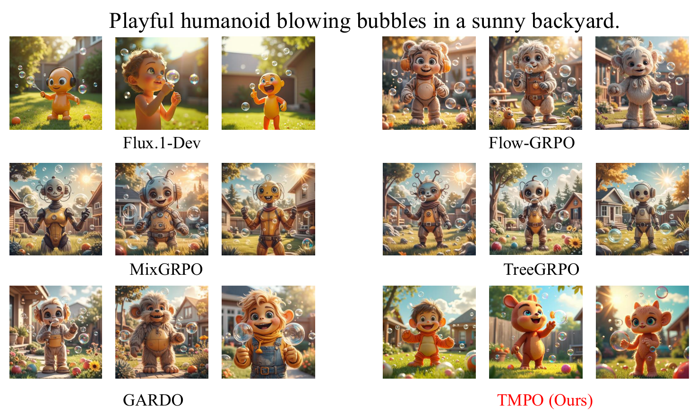
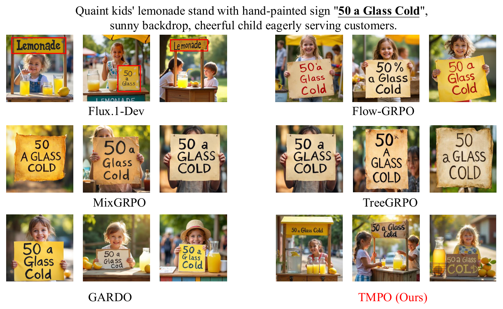
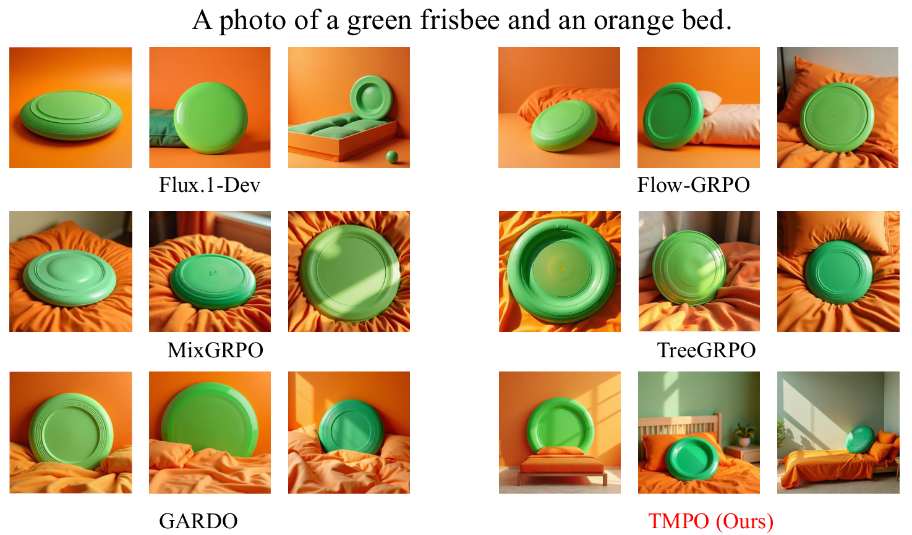

<div align="center">

# TMPO: Trajectory Matching Policy Optimization

### Diverse and Efficient Diffusion Model Alignment via Trajectory-Level Reward Distribution Matching

[](https://github.com/Chael-Chael/TMPO)
[](https://www.python.org/)
[](https://pytorch.org/)
[](https://github.com/huggingface/diffusers)
[](#citation)

[Highlights](#highlights) | [Method](#method) | [Results](#results) | [Get Started](#get-started) | [Code Map](#code-map) | [Star History](#star-history) | [Citation](#citation)

</div>

---

TMPO is a reinforcement learning framework for aligning diffusion and flow-matching models without collapsing generation diversity. Instead of maximizing a scalar reward directly, TMPO matches the policy distribution over complete denoising trajectories to a reward-induced Boltzmann distribution. The result is a mode-covering objective that keeps multiple plausible high-reward outputs alive while still improving downstream reward.

The implementation in this repository provides the training code for **Softmax Trajectory Balance (Softmax-TB)**, **Dynamic Stochastic Tree Sampling**, multi-reward aggregation, inline evaluation, and distributed LoRA fine-tuning for SD3.5-Medium and FLUX-style models.

## News

- **2026.05** - Initial TMPO code release with FLUX/SD3.5 training configs, tree sampling, Softmax-TB loss, multi-reward wrappers, and inline evaluation.
- **2026.05** - Preprint: *TMPO: Trajectory Matching Policy Optimization for Diverse and Efficient Diffusion Alignment*.

## Highlights

- **Reward distribution matching, not reward maximization.** TMPO optimizes a trajectory-level distribution target, reducing the mode-seeking behavior that drives visual mode collapse.
- **Softmax Trajectory Balance.** The loss matches normalized trajectory log-probabilities to `softmax(beta * reward)`, avoiding an explicit global partition function.
- **Dynamic Stochastic Tree Sampling.** Denoising prefixes are shared, then trajectories branch at scheduled SDE steps; with `k=3` and three branch levels, one prompt yields up to 27 terminal trajectories.
- **Multi-reward training.** HPSv2, CLIPScore, PickScore, ImageReward, GenEval, OCR, and aesthetic scoring can be combined with per-group normalization.
- **Scalable alignment.** The code supports LoRA, FSDP, bf16, gradient diagnostics, checkpointing, EMA, and inline evaluation.
- **Paper-level outcome.** On FLUX.1-dev, TMPO reports a 9.1% average diversity improvement over prior state-of-the-art methods while reaching competitive or best downstream rewards and reducing training time by up to 27%.

## Demo

<p align="center">
  
</p>
<p align="center"><em>Figure 1. Qualitative comparison on a visual preference prompt, where TMPO preserves diverse high-reward humanoid designs while matching the requested scene.</em></p>

<p align="center">
  
</p>
<p align="center"><em>Figure 2. OCR-sensitive prompt comparison, testing whether the aligned model keeps the requested sign text and surrounding lemonade-stand context.</em></p>

<p align="center">
  
</p>
<p align="center"><em>Figure 3. GenEval-style object and attribute binding prompt, comparing how methods render a green frisbee together with an orange bed.</em></p>

## Method

### Why Distribution Matching?

Standard diffusion RL methods usually optimize expected reward. This is effective for improving a single metric, but it is intrinsically mode-seeking: when many outputs are acceptable, the model can over-concentrate on a small subset that exploits the proxy reward. TMPO reframes alignment as matching a reward-induced trajectory distribution, so high-reward alternatives can all receive probability mass.

### Softmax Trajectory Balance

For `K` trajectories sampled from the same prompt group, TMPO computes cumulative trajectory log-probabilities and terminal rewards:

```text
log_p_i = log P_theta(tau_i)
target_i = log softmax(beta * R(tau_i))
policy_i = log softmax(log_p_i)
advantage_i = target_i - policy_i
```

This group normalization cancels the intractable partition terms and makes the objective directly optimizable over observed trajectories. In code, the core implementation lives in [`tmpo/losses/softmax_tb.py`](tmpo/losses/softmax_tb.py) and is assembled with clipped importance sampling and reference constraints in [`tmpo/losses/total_loss.py`](tmpo/losses/total_loss.py).

### Dynamic Stochastic Tree Sampling

Naively sampling many full denoising trajectories is expensive. TMPO instead shares deterministic denoising prefixes and injects stochastic SDE branches only at scheduled split points. The tree sampler supports:

- branch factor `tree.k`
- `tree.branch_levels`
- `tree.max_leaves`
- fixed or progress-aware schedules
- FLUX dynamic sigma shift
- chunked log-prob recomputation for memory control

The implementation is in [`tmpo/sampling/tree_sampler.py`](tmpo/sampling/tree_sampler.py) and [`tmpo/sampling/scheduler.py`](tmpo/sampling/scheduler.py).

## Results

The following compact table summarizes key FLUX.1-dev results from the preprint. Lower time is better; higher reward and diversity metrics are better.

| Protocol | Primary metric | TMPO time / iter | Preference score | Diversity |
|---|---:|---:|---:|---:|
| Compositional generation | GenEval `0.949` | `91.9s` | PickScore `22.901` | LGMD `0.131`, Cos.Div. `0.247` |
| Visual text rendering | OCR Acc. `0.935` | `76.3s` | HPSv2 `0.310`, PickScore `22.309` | LGMD `0.110`, Cos.Div. `0.241` |
| Human preference alignment | PickScore `24.277` | `68.3s` | HPSv2 `0.373`, ImgReward `1.610` | LGMD `0.204`, Cos.Div. `0.252` |

TMPO is designed to improve the trade-off between reward, diversity, and efficiency rather than optimizing one scalar score at the expense of all others.

## Get Started

### 1. Clone

```bash
git clone https://github.com/Chael-Chael/TMPO.git
cd TMPO
```

### 2. Create Environment

```bash
conda create -n tmpo python=3.10 -y
conda activate tmpo

pip install torch==2.3.0 torchvision==0.18.0 --index-url https://download.pytorch.org/whl/cu121
pip install accelerate==0.33.0 diffusers==0.30.0 transformers==4.44.0 peft
pip install open_clip_torch requests pyyaml Pillow numpy wandb
```

Optional reward dependencies:

```bash
pip install image-reward
pip install git+https://github.com/openai/CLIP.git
```

For a more exhaustive setup path, see [`setup_guide.md`](setup_guide.md).

### 3. Prepare Models and Rewards

SD3.5-Medium requires Hugging Face access approval:

```bash
huggingface-cli login
mkdir -p models/sd35m
huggingface-cli download stabilityai/stable-diffusion-3.5-medium --local-dir ./models/sd35m
```

HPSv2 / OpenCLIP reward weights:

```bash
mkdir -p reward_ckpt
hf download xswu/HPSv2 HPS_v2.1_compressed.pt --local-dir ./reward_ckpt/
hf download laion/CLIP-ViT-H-14-laion2B-s32B-b79K open_clip_pytorch_model.bin --local-dir ./reward_ckpt/
```

Set the corresponding paths in the YAML config before training:

```yaml
reward:
  hps_path: "./reward_ckpt/HPS_v2.1_compressed.pt"
  hps_clip_path: "./reward_ckpt/open_clip_pytorch_model.bin"
```

### 4. Prepare Prompts

Training expects a JSON prompt file. Supported formats include a list of strings, a list of objects with a `prompt` field, or a dictionary of id-to-prompt pairs.

```bash
mkdir -p data
python - <<'PY'
import json
prompts = [
    "a cinematic photo of a robot doing yoga in a minimalist studio",
    "a vintage farmer's almanac header with rustic seed illustrations",
    "a wooden hiking sign reading To Summit 1 Mile on a misty trail",
] * 100
with open("data/pickapic_prompts.json", "w", encoding="utf-8") as f:
    json.dump(prompts, f, indent=2)
PY
```

Update `dataset.data_json_path` in your config if you use a different path.

### 5. Train

FLUX-style training:

```bash
bash scripts/train_flux.sh config/flux_lora_pickscore.yaml \
  --max_steps 500 \
  --wandb_project tmpo
```

SD3.5-Medium LoRA training:

```bash
bash scripts/train_sd35m.sh
```

Manual launch:

```bash
accelerate launch --config_file accelerate_configs/fsdp_small.yaml \
  --num_processes 4 \
  tmpo/train.py \
  --config config/sd35m_lora.yaml \
  --lr 1e-5 \
  --beta 15.0
```

Fast smoke run:

```bash
accelerate launch --config_file accelerate_configs/single_gpu.yaml \
  tmpo/train.py \
  --config config/sd35m_lora.yaml \
  --max_steps 2 \
  --grad_accum 1 \
  --is_num_updates 1 \
  --no_wandb \
  --no_eval
```

## Configuration

All YAML values can be overridden from the CLI. Common options:

| CLI | YAML path | Purpose |
|---|---|---|
| `--lr` | `training.learning_rate` | Optimizer learning rate |
| `--max_steps` | `training.max_train_steps` | Number of training iterations |
| `--grad_accum` | `training.gradient_accumulation_steps` | Gradient accumulation |
| `--batch_size` | `training.vae_decode_batch_size` | Reward decode batch size |
| `--beta` | `loss.beta` | Softmax-TB reward temperature |
| `--lambda_ref` | `loss.lambda_ref` | Reference trajectory constraint |
| `--is_num_updates` | `loss.is_num_updates` | Importance-sampling update passes |
| `--tree_k` | `tree.k` | Branching factor |
| `--num_inference_steps` | `tree.num_inference_steps` | Training rollout steps |
| `--force_fixed_schedule` | `tree.force_fixed_schedule` | Use fixed split/noise schedule |
| `--eval_every` | `eval.eval_every` | Inline evaluation interval |

Reward aggregation modes are implemented in [`tmpo/rewards/compute.py`](tmpo/rewards/compute.py):

- `advantage_aggr`: z-score each reward model within the trajectory group, then weighted-sum. Recommended for heterogeneous rewards.
- `reward_aggr`: weighted-sum raw rewards, then normalize the aggregate.
- `raw_aggr`: weighted-sum raw rewards directly. Useful for already calibrated scores or evaluation.

## Code Map

```text
TMPO/
|-- accelerate_configs/       # Accelerate/FSDP launch configs
|-- config/                   # SD3.5 and FLUX training YAMLs
|-- Data/                     # Example prompt files
|-- scripts/                  # Training entry scripts
|-- tmpo/
|   |-- train.py              # Main training loop and CLI
|   |-- sampling/             # SDE step, scheduler, tree sampler
|   |-- losses/               # Softmax-TB, RatioNorm IS, reference loss
|   |-- rewards/              # HPSv2, CLIPScore, PickScore, ImageReward, GenEval, OCR
|   |-- eval/                 # Inline evaluation and diversity metrics
|   `-- utils/                # Distributed helpers, checkpointing, EMA, logging
`-- setup_guide.md            # Step-by-step deployment guide
```

## Training Signals

During training, TMPO logs reward, diversity, trajectory probability, and optimization diagnostics. Useful fields include:

| Metric | Meaning |
|---|---|
| `loss_soft_tb` | Softmax-TB distribution matching monitor |
| `mean_reward` | Mean normalized reward over sampled trajectories |
| `reward_raw_primary_mean` | Mean raw score for the primary reward model |
| `num_branches` | Number of terminal tree trajectories |
| `diversity_lgmd` | Latent-space diversity estimate |
| `diversity_cosine` | CLIP/DINO-style feature diversity estimate |
| `approx_kl` | Policy shift proxy |
| `ratio_mean`, `ratio_std`, `clipfrac` | Importance-ratio diagnostics |
| `grad_norm` | Post-clip gradient norm |

## Star History

<a href="https://star-history.com/#Chael-Chael/TMPO&Date">
  <picture>
    <source media="(prefers-color-scheme: dark)" srcset="https://api.star-history.com/svg?repos=Chael-Chael/TMPO&type=Date&theme=dark" />
    <source media="(prefers-color-scheme: light)" srcset="https://api.star-history.com/svg?repos=Chael-Chael/TMPO&type=Date" />
    
  </picture>
</a>

## Citation

If this code or paper is useful for your research, please cite:

```bibtex
@article{li2026tmpo,
  title   = {TMPO: Trajectory Matching Policy Optimization for Diverse and Efficient Diffusion Alignment},
  author  = {Li, Jiaming and Zhu, Chenyu and Yi, Nanxi and Bao, Youjun and Sun, Li and Lv, Quanying and Fang, Xiang and Liu, Daizong and Li, Jianjun and He, Kun and Zhou, Bowen and Ma, Zhiyuan},
  journal = {Preprint},
  year    = {2026}
}
```
