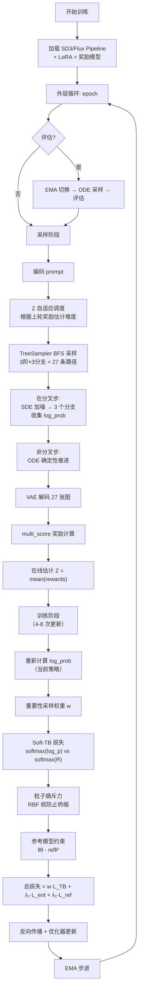

# Z-AFT 代码框架与实现规划

> 基于 [new-project.md](file:///d:/HuaweiMoveData/Users/李嘉明/Desktop/Softmax-GRPO/new-project.md) 的方案设计，结合 TreeGRPO、flow_grpo、FlowRL 三个项目的代码分析，设计 Z-AFT 的代码结构和实现流程。

---

## 一、技术选型决策

基于三个参考项目的对比分析，Z-AFT 的技术选型如下：

| 维度 | 决策 | 来源 | 理由 |
|------|------|------|------|
| 基础模型 | SD3.5-Medium / Flux | flow_grpo | 支持多模型，LoRA 微调成熟 |
| 采样框架 | 树状 SDE 采样 | **TreeGRPO** | 3阶27分支结构与 TreeGRPO 的 BFS 树高度一致 |
| SDE 实现 | `sde_step_with_logprob` | **flow_grpo** | 支持 SDE/CPS 两种模式，代码更成熟 |
| 损失函数 | Soft-TB（自研） | **FlowRL** 启发 | 将 TB 从 LLM token-level 改造为 diffusion trajectory-level |
| 分布式 | Accelerate + FSDP | flow_grpo | 工程稳定，社区支持好 |
| 奖励系统 | multi_score 多奖励组合 | flow_grpo | 支持 12 种奖励，易扩展 |
| EMA | decay=0.9, interval=8 | flow_grpo | 训练稳定性保障 |
| 配置 | Hydra + YAML | TreeGRPO | 简洁直观，易于实验管理 |

---

## 二、项目目录结构

```
Z-AFT/
├── README.md                            # 项目说明
├── requirements.txt                     # 依赖
├── setup.py                             # 包安装
│
├── configs/                             # Hydra 配置
│   ├── base.yaml                        # 基础配置
│   ├── sd3_hps.yaml                     # SD3 + HPSv2 实验
│   ├── sd3_geneval.yaml                 # SD3 + GenEval 实验
│   └── flux_pickscore.yaml              # Flux + PickScore 实验
│
├── z_aft/                               # 核心包
│   ├── __init__.py
│   │
│   ├── tree/                            # 🌲 树状采样核心
│   │   ├── __init__.py
│   │   ├── tree_node.py                 # [新] TreeNode 数据结构
│   │   ├── tree_sampler.py              # [新] 3阶树状 BFS 采样器
│   │   └── adaptive_scheduler.py        # [新] Z 自适应调度器
│   │
│   ├── sde/                             # SDE 采样 + log_prob
│   │   ├── __init__.py
│   │   ├── sde_step.py                  # [改] 基于 flow_grpo 的 sde_step_with_logprob
│   │   └── pipeline.py                  # [改] 基于 TreeGRPO 的树状 Pipeline
│   │
│   ├── losses/                          # 损失函数
│   │   ├── __init__.py
│   │   ├── soft_tb.py                   # [新] Softmax-TB 分布匹配损失
│   │   ├── particle_entropy.py          # [新] RBF 核粒子熵斥力
│   │   ├── reference_loss.py            # [新] 参考模型约束
│   │   └── importance_sampling.py       # [新] 重要性采样权重
│   │
│   ├── rewards/                         # 奖励系统
│   │   ├── __init__.py
│   │   ├── hps.py                       # [复用] HPSv2
│   │   ├── clip_scorer.py               # [复用] CLIP
│   │   ├── pickscore.py                 # [复用] PickScore
│   │   ├── aesthetic.py                 # [复用] Aesthetic
│   │   └── multi_score.py               # [复用] 多奖励组合
│   │
│   ├── utils/                           # 工具模块
│   │   ├── __init__.py
│   │   ├── ema.py                       # [复用] EMA 管理
│   │   ├── stat_tracking.py             # [复用] Per-Prompt 统计
│   │   └── fsdp_utils.py                # [复用] FSDP 工具
│   │
│   └── models/                          # 模型加载
│       ├── __init__.py
│       └── model_loader.py              # SD3/Flux 模型加载 + LoRA
│
├── scripts/                             # 训练脚本
│   ├── train.py                         # 主训练入口
│   ├── eval.py                          # 评估脚本
│   ├── accelerate_configs/
│   │   ├── single_gpu.yaml
│   │   └── multi_gpu.yaml
│   └── launch/
│       ├── train_sd3_hps.sh
│       └── train_flux_pickscore.sh
│
├── dataset/                             # 数据集
│   ├── hpd.txt                          # HPD prompts
│   └── geneval/                         # GenEval 数据
│
└── code-analysis/                       # 参考项目分析（已完成）
    ├── TreeGRPO_analysis.md
    ├── flow_grpo_analysis.md
    └── FlowRL_analysis.md
```

---

## 三、核心模块设计

### 3.1 `z_aft/tree/tree_node.py` — 树节点数据结构

```python
@dataclass
class TreeNode:
    """三阶树的节点，改编自 TreeGRPO 的 TreeOutput"""
    # 节点身份
    depth: int                      # 0=root, 1/2/3=分叉层
    branch_id: int                  # 在当前层的分支编号 (0, 1, 2)
    parent: Optional['TreeNode']
    children: List['TreeNode']
    
    # 采样数据（非叶子节点）
    latent_in: torch.Tensor         # 输入 latent（用于训练回放）
    latent_out: List[torch.Tensor]  # 输出 latent（k 个分支）
    timestep: float                 # 当前时间步
    log_prob: List[float]           # 每个分支的 log_prob
    
    # 叶子数据
    image: Optional[torch.Tensor]   # VAE 解码图像
    reward: Optional[float]         # 奖励分数
    
    # 轨迹级数据
    trajectory_log_prob: float      # 整条路径的累积 log_prob
    advantage: float                # 优势值
    
    def get_path_log_prob(self) -> float:
        """递归计算从 root 到当前节点的累积 log_prob"""
        if self.parent is None:
            return 0.0
        return self.parent.get_path_log_prob() + self.log_prob
    
    def get_all_leaves(self) -> List['TreeNode']:
        """BFS 收集所有 27 个叶子节点"""
        if not self.children:
            return [self]
        leaves = []
        for child in self.children:
            leaves.extend(child.get_all_leaves())
        return leaves
```

### 3.2 `z_aft/tree/tree_sampler.py` — 树状采样器

```python
class TreeSampler:
    """3阶27分支树状 BFS 采样器
    
    结合 TreeGRPO 的 BFS 树遍历 + flow_grpo 的 SDE 步进
    """
    def __init__(self, pipeline, config):
        self.pipeline = pipeline
        self.k = config.tree.k         # 每层分支数 (3)
        self.split_steps = config.tree.split_steps  # [8, 5, 2] 分叉时间步
        self.num_steps = config.sample.num_steps    # 总去噪步数 (10)
        self.noise_level = config.sample.noise_level
        self.use_ode_between = config.tree.use_ode  # 非分叉步用 ODE
    
    @torch.no_grad()
    def sample(self, prompt_embeds, pooled_embeds, 
               neg_embeds, neg_pooled, latents=None) -> TreeNode:
        """BFS 构建完整树，返回 root 节点"""
        
        root = TreeNode(depth=0, parent=None)
        # BFS 队列: (latent, current_step_index, node)
        queue = [(latents, 0, root)]
        
        while queue:
            lat, step_idx, node = queue.pop(0)
            
            if step_idx >= self.num_steps:
                # 叶子节点：VAE 解码
                node.image = self.decode(lat)
                continue
            
            t = self.pipeline.scheduler.timesteps[step_idx]
            
            # Transformer 推理
            noise_pred = self.predict_noise(lat, t, prompt_embeds, pooled_embeds,
                                            neg_embeds, neg_pooled)
            
            # 判断是否为分叉步
            is_split = step_idx in self.split_steps
            k = self.k if is_split else 1
            use_ode = self.use_ode_between and not is_split
            
            # SDE/ODE 步进
            next_latents, log_probs = sde_step_with_logprob(
                self.pipeline.scheduler, noise_pred, t, lat,
                noise_level=self.noise_level if not use_ode else 0,
                tree_k=k
            )
            
            # 保存节点数据（用于训练回放）
            if is_split:
                node.latent_in = lat.detach()
                node.timestep = t
            
            # 创建子节点
            for branch_idx, (next_lat, lp) in enumerate(zip(next_latents, log_probs)):
                child = TreeNode(depth=node.depth + (1 if is_split else 0),
                                 branch_id=branch_idx, parent=node)
                child.log_prob = lp
                node.children.append(child)
                queue.append((next_lat, step_idx + 1, child))
        
        return root
```

### 3.3 `z_aft/tree/adaptive_scheduler.py` — Z 自适应调度

```python
class AdaptiveTreeScheduler:
    """根据在线估计的难度 Z 动态调整树参数
    
    灵感来自 new-project.md 的 Z_φ 难度感知预热
    与 FlowRL 的 ProjZModule 不同，这里 Z 不参与梯度，仅做调度
    """
    def __init__(self, config):
        self.default_splits = config.tree.split_steps  # [8, 5, 2]
        self.z_threshold_low = config.tree.z_low        # 难题阈值
        self.z_threshold_high = config.tree.z_high       # 简单题阈值
    
    def estimate_z(self, rewards: List[float]) -> float:
        """用组内奖励均值在线估计 Z"""
        return np.mean(rewards)
    
    def get_tree_config(self, z: float) -> dict:
        """根据 Z 值返回自适应树配置"""
        if z < self.z_threshold_low:
            # 难题：提前分叉，增加探索
            return {
                "split_steps": [9, 7, 5],  # 更早分叉
                "k": 3,
                "noise_level": 0.8,        # 更多噪声
            }
        elif z > self.z_threshold_high:
            # 简单题：晚期分叉，节省算力
            return {
                "split_steps": [6, 3, 1],  # 晚期分叉
                "k": 3,
                "noise_level": 0.5,        # 更少噪声
            }
        else:
            # 正常：使用默认配置
            return {
                "split_steps": self.default_splits,
                "k": 3,
                "noise_level": 0.7,
            }
```

### 3.4 `z_aft/losses/soft_tb.py` — Softmax-TB 损失

```python
class SoftTBLoss(nn.Module):
    """Softmax-Trajectory Balance 损失
    
    核心创新：将 FlowRL 的 TB 从 token-level 改造为 trajectory-level
    通过 softmax 归一化绕过对 Z 的直接拟合
    """
    def forward(self, log_probs: torch.Tensor, rewards: torch.Tensor) -> torch.Tensor:
        """
        Args:
            log_probs: (27,) 每条路径的累积 log_prob
            rewards:   (27,) 每条路径的奖励
        Returns:
            loss: 标量
        """
        # 路径概率的 softmax 分布
        log_p_dist = F.log_softmax(log_probs, dim=0)  # (27,)
        
        # 奖励的 softmax 分布（目标分布）
        log_r_dist = F.log_softmax(rewards, dim=0)     # (27,)
        
        # TB 残差平方损失
        delta = log_p_dist - log_r_dist  # (27,)
        loss = (delta ** 2).sum()
        
        return loss
```

### 3.5 `z_aft/losses/particle_entropy.py` — 粒子熵斥力

```python
class ParticleEntropyLoss(nn.Module):
    """基于 RBF 核的粒子间斥力，防止模式坍缩
    
    当两个分支生成的图像在特征空间太接近时，产生斥力
    """
    def __init__(self, feature_extractor='clip', bandwidth='auto'):
        self.feature_extractor = feature_extractor
        self.bandwidth = bandwidth
    
    def forward(self, images: torch.Tensor) -> torch.Tensor:
        """
        Args:
            images: (27, C, H, W) 所有叶子节点的图像
        Returns:
            loss: 标量（越大表示越相似，需要最小化）
        """
        # 提取特征
        features = self.extract_features(images)  # (27, D)
        
        # 计算两两距离矩阵
        dists = torch.cdist(features, features)  # (27, 27)
        
        # 自适应带宽
        if self.bandwidth == 'auto':
            h = torch.median(dists) ** 2 / np.log(len(features))
        else:
            h = self.bandwidth
        
        # RBF 核相似度（排除对角线）
        K = torch.exp(-dists ** 2 / h)
        mask = 1 - torch.eye(len(features), device=K.device)
        loss = (K * mask).sum() / (mask.sum())
        
        return loss
```

### 3.6 `z_aft/losses/reference_loss.py` — 参考模型约束

```python
class ReferenceLoss(nn.Module):
    """参考模型约束，防止策略漂移
    
    与 flow_grpo 的 KL 正则化类似，但采用 FlowRL 风格的 TB 残差
    """
    def forward(self, log_probs_theta: torch.Tensor, 
                log_probs_ref: torch.Tensor,
                num_steps: int) -> torch.Tensor:
        """
        Args:
            log_probs_theta: (27,) 当前策略的累积 log_prob
            log_probs_ref:   (27,) 参考策略的累积 log_prob
            num_steps:       路径长度（用于归一化）
        """
        # 长度归一化
        avg_theta = log_probs_theta / num_steps
        avg_ref = log_probs_ref / num_steps
        
        # 残差平方
        loss = ((avg_theta - avg_ref) ** 2).mean()
        return loss
```

### 3.7 `z_aft/losses/importance_sampling.py` — 重要性采样

```python
class ImportanceSamplingWeight:
    """重要性采样权重计算，支持多次更新
    
    参考 FlowRL 和 flow_grpo 的 PPO-Clip 风格设计
    """
    def __init__(self, clip_range=0.2):
        self.clip_range = clip_range
    
    def compute(self, log_probs_new: torch.Tensor, 
                log_probs_old: torch.Tensor) -> torch.Tensor:
        """
        Args:
            log_probs_new: (27,) 当前策略的 log_prob
            log_probs_old: (27,) 采样时策略的 log_prob
        Returns:
            weights: (27,) clipped importance weights (detached)
        """
        log_ratio = log_probs_new - log_probs_old
        ratio = torch.exp(log_ratio)
        clipped = torch.clamp(ratio, 1 - self.clip_range, 1 + self.clip_range)
        return clipped.detach()
```

---

## 四、主训练脚本设计 (`scripts/train.py`)

```python
def main():
    # ====== 1. 初始化 ======
    config = load_config()
    accelerator = Accelerator(...)
    pipeline = load_model(config)        # SD3/Flux + LoRA
    reward_fn = multi_score(config)      # 多奖励组合
    tree_sampler = TreeSampler(pipeline, config)
    z_scheduler = AdaptiveTreeScheduler(config)
    
    # 损失函数
    soft_tb = SoftTBLoss()
    entropy_loss = ParticleEntropyLoss()
    ref_loss = ReferenceLoss()
    is_weight = ImportanceSamplingWeight()
    
    optimizer, ema, stat_tracker = setup_training(config)
    
    # ====== 2. 主训练循环 ======
    for epoch in range(config.num_epochs):
        # ---- 评估 ----
        if epoch % config.eval_freq == 0:
            evaluate(pipeline, test_dataloader, reward_fn, ema)
        
        # ---- 采样阶段 ----
        pipeline.transformer.eval()
        for batch in train_dataloader:
            prompts = batch["prompts"]
            prompt_embeds = encode(prompts)
            
            # (a) 自适应树配置
            # 首轮用默认，后续根据上一轮奖励调整
            tree_config = z_scheduler.get_tree_config(z_estimate)
            
            # (b) 树状采样：生成 27 条路径
            root = tree_sampler.sample(
                prompt_embeds, ..., 
                split_steps=tree_config["split_steps"],
                noise_level=tree_config["noise_level"]
            )
            
            # (c) 计算奖励
            leaves = root.get_all_leaves()  # 27 个叶子
            images = torch.stack([leaf.image for leaf in leaves])
            rewards = reward_fn(images, prompts)
            for leaf, r in zip(leaves, rewards):
                leaf.reward = r
            
            # (d) 在线估计 Z
            z_estimate = z_scheduler.estimate_z(rewards.tolist())
            
            # (e) 收集路径数据
            log_probs_old = torch.stack([leaf.get_path_log_prob() for leaf in leaves])
        
        # ---- 训练阶段：多次更新 ----
        pipeline.transformer.train()
        for update_iter in range(config.train.num_updates):  # 4-8 次
            # (a) 遍历分叉节点，重新计算 log_prob
            log_probs_new = recompute_log_probs(pipeline, root)
            
            # (b) 重要性采样权重
            w = is_weight.compute(log_probs_new, log_probs_old)
            
            # (c) 计算总损失
            L_soft_tb = soft_tb(log_probs_new, rewards)
            L_entropy = entropy_loss(images)
            L_ref = ref_loss(log_probs_new, log_probs_ref, num_steps)
            
            loss = w * L_soft_tb + λ1 * L_entropy + λ2 * L_ref
            
            # (d) 反向传播
            accelerator.backward(loss.mean())
            optimizer.step()
            optimizer.zero_grad()
            
            # (e) EMA 更新
            ema.step(params, global_step)
```

---

## 五、训练流程图



---

## 六、实现优先级与阶段规划

### Phase 1: 最小可行版本 (MVP)
> 目标：跑通基本训练流程

| 任务 | 优先级 | 参考来源 |
|------|--------|---------|
| TreeNode 数据结构 | P0 | TreeGRPO `TreeOutput` |
| SDE 步进 + log_prob | P0 | flow_grpo `sd3_sde_with_logprob.py` |
| 树状 BFS 采样 | P0 | TreeGRPO `sd3_pipeline_with_logprob` |
| Soft-TB 损失 | P0 | FlowRL TB 启发 |
| HPSv2 奖励 | P0 | TreeGRPO `hps.py` |
| 基础训练循环 | P0 | flow_grpo `train_sd3.py` |

### Phase 2: 完整功能
> 目标：论文级别的完整实现

| 任务 | 优先级 | 参考来源 |
|------|--------|---------|
| 粒子熵斥力 | P1 | 全新实现 |
| 参考模型约束 | P1 | flow_grpo KL + FlowRL ref |
| 重要性采样多次更新 | P1 | FlowRL IS |
| Z 自适应调度 | P1 | 全新实现 |
| Per-Prompt 统计 | P1 | flow_grpo `stat_tracking.py` |
| EMA | P1 | flow_grpo `ema.py` |
| 多奖励组合 | P1 | flow_grpo `rewards.py` |

### Phase 3: 工程优化
> 目标：大规模训练和论文实验

| 任务 | 优先级 | 参考来源 |
|------|--------|---------|
| Flux 模型支持 | P2 | flow_grpo |
| FSDP 分布式 | P2 | flow_grpo |
| WandB 完整日志 | P2 | flow_grpo |
| 多节点训练脚本 | P2 | flow_grpo |
| GenEval 评估 | P2 | flow_grpo |

---

## 七、关键实现细节

### 7.1 log_prob 累积方式

```python
# TreeGRPO: 树上每步独立 log_prob
# flow_grpo: 全链路 log_prob（所有步的和）
# Z-AFT: 仅在分叉步累积 log_prob（3 个步的和）
trajectory_log_prob = sum(split_step_log_probs)  # 仅 3 项
```

**理由**：ODE 步骤是确定性的，没有随机性，log_prob 无意义。仅在 SDE 分叉步才有概率密度。

### 7.2 训练回放机制

```python
# 训练时需要重新计算当前策略的 log_prob
# 仅需对 3 个分叉步做前向推理（而非全部 10 步）
for split_node in tree.get_split_nodes():
    noise_pred = transformer(split_node.latent_in, split_node.timestep, ...)
    _, new_log_prob, _, _ = sde_step_with_logprob(
        ..., prev_sample=split_node.latent_out  # 固定输出计算 log_prob
    )
```

### 7.3 显存优化策略

| 策略 | 来源 | 效果 |
|------|------|------|
| LoRA 微调 | flow_grpo | 仅 ~2% 参数可训练 |
| 梯度检查点 | flow_grpo | 用计算换显存 |
| 仅分叉步回放 | Z-AFT 创新 | 减少 70% 前向推理 |
| BFS 逐节点处理 | TreeGRPO | 避免同时存储 27 条路径 |
| bf16 混合精度 | 通用 | 减半显存 |

### 7.4 与 FlowRL TB 的核心差异

| | FlowRL TB | Z-AFT Soft-TB |
|--|-----------|---------------|
| 领域 | LLM token 序列 | Diffusion latent 轨迹 |
| Z 处理 | 3层 MLP 学习 log Z | softmax 归一化消除 Z |
| 轨迹表示 | token 级 log_prob 平均 | 分叉步 log_prob 求和 |
| 参考模型 | avg token log_ref | 轨迹级 log_ref |
| β 缩放 | β=15 乘以奖励 | 无需（在 softmax 中自然缩放） |
