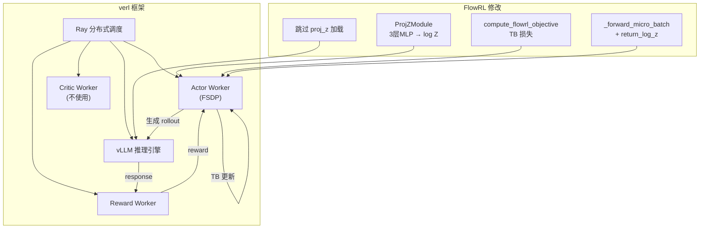
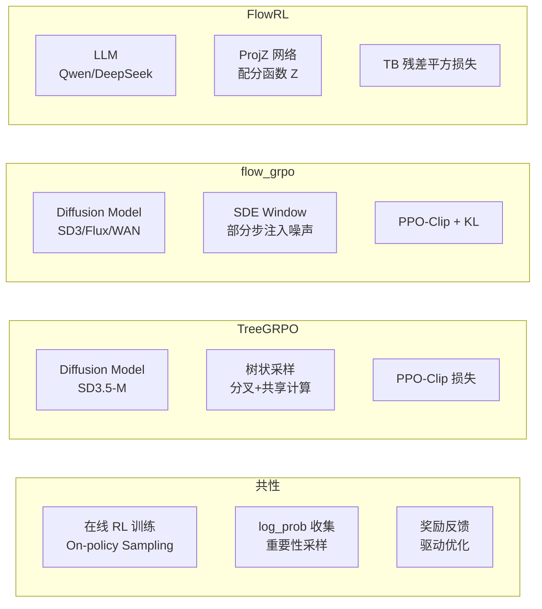

# FlowRL 项目代码深度分析

> **论文**: FlowRL: Matching Reward Distributions via Flow Balance (arXiv:2509.15207)
> **核心创新**: 用 GFlowNet 的 Trajectory Balance (TB) 目标替代 PPO/GRPO 的策略梯度，将 RL 训练从"最大化奖励"转变为"匹配奖励分布"，促进多样性探索和知识泛化。
> **领域**: LLM 推理 (Math/Code)，非扩散模型（与另外两个项目不同）

---

## 一、项目目录结构

```
FlowRL-main/
├── README.md                         # 项目概览 + Quick Start
├── FLOWRL_SIMPLE_GUIDE.md            # 4步实现指南（核心！）
├── LICENSE
├── .gitignore
├── data/                             # 数据相关
│   └── README.md
├── preprocess/                       # 数据预处理
│   ├── check_data.py                 # 数据检查
│   ├── down_load_dataset.sh          # 下载数据集
│   ├── down_load_model.sh            # 下载模型
│   └── deepcoder/                    # DeepCoder 数据处理
├── verl_FlowRL/                      # 基于 verl 0.4.0 的主代码
│   ├── command/                      # 训练/评估启动脚本
│   │   └── training/
│   │       ├── math/
│   │       │   ├── flowrl_7B_math.sh
│   │       │   └── flowrl_32B_math.sh
│   │       └── code/
│   │           └── flowrl_7B_code.sh
│   ├── verl/                         # 修改后的 verl 框架
│   │   ├── workers/
│   │   │   ├── fsdp_workers.py       # ProjZModule 定义
│   │   │   ├── actor/
│   │   │   │   └── dp_actor.py       # FlowRL 核心损失
│   │   │   └── sharding_manager/
│   │   │       └── fsdp_vllm.py      # 模型加载修补
│   │   └── ...
│   ├── rllm/                         # RL for LLM 工具库
│   │   ├── rewards/                  # 奖励函数
│   │   ├── data/                     # 数据处理
│   │   └── tools/                    # 工具链
│   ├── examples/
│   │   └── grpo_trainer/             # GRPO 训练器示例
│   ├── recipe/
│   │   └── flowrl/                   # FlowRL 配方
│   └── ...
├── verl_Test/                        # 测试评估代码
│   └── command/
│       └── eval/
│           ├── merge_model.sh
│           ├── math/
│           └── code/
└── figures/                          # 论文图片
```

---

## 二、核心算法：Trajectory Balance (TB) 目标

### 2.1 与 PPO/GRPO 的本质区别

| | PPO/GRPO (TreeGRPO, flow_grpo) | FlowRL |
|--|------|--------|
| 目标 | 最大化期望奖励 | 匹配奖励分布 |
| 损失 | 策略梯度 (ratio × advantage) | TB 残差平方 |
| 多样性 | 需要 entropy bonus | 自然保持 |
| 分布坍缩 | 容易发生 | 不易发生 |
| 适用领域 | Diffusion Models | LLM Reasoning |

### 2.2 TB 目标函数

$$\mathcal{L}_{\text{FlowRL}} = w \cdot \left( \log Z_\phi(x) + \frac{1}{|y|}\log \pi_\theta(y|x) - \beta \hat{r}(x,y) - \frac{1}{|y|}\log \pi_{\text{ref}}(y|x) \right)^2$$

其中：
- $\log Z_\phi(x)$：可学习的配分函数（partition function），由 `ProjZModule` 网络预测
- $\frac{1}{|y|}\log \pi_\theta(y|x)$：当前策略的平均 token log probability
- $\beta \hat{r}(x,y)$：缩放后的奖励信号（$\beta=15$）
- $\frac{1}{|y|}\log \pi_{\text{ref}}(y|x)$：参考策略的平均 token log probability
- $w$：重要性采样权重 $w = \exp(\log \pi_\theta - \log \pi_{\text{old}})$，clipped

**直觉理解**：
- 当残差 > 0：策略对高奖励样本给了过多概率 → 应降低
- 当残差 < 0：策略对高奖励样本给了不足概率 → 应提高
- 通过最小化残差平方，使策略分布 $\propto \pi_{\text{ref}} \cdot e^{\beta r}$

---

## 三、四步实现指南（FLOWRL_SIMPLE_GUIDE.md 详解）

### Step 1: 添加配分函数 Z — `ProjZModule`

```python
class ProjZModule(torch.nn.Module):
    """3层 MLP，将 prompt hidden state 映射为标量 log Z"""
    def __init__(self, hidden_size, num_layers=3, dropout=0.1):
        layers = []
        for i in range(num_layers - 1):
            layers.extend([
                nn.Linear(hidden_size, hidden_size),
                nn.GELU(),
                nn.LayerNorm(hidden_size),
                nn.Dropout(dropout)
            ])
        layers.append(nn.Linear(hidden_size, 1))
        self.net = nn.Sequential(*layers)
    
    def forward(self, x):
        return self.net(x)  # → (B, 1)
```

**挂载位置**：直接作为 `actor_module.proj_z` 属性，与主模型一起参与 FSDP 分片和优化器更新。

### Step 2: 修改前向传播 — 提取 Prompt Hidden State

```python
def _forward_micro_batch(self, micro_batch, ..., return_log_z=False):
    # 标准前向：得到 entropy, log_probs
    output = model(...)
    
    if return_log_z:
        # 提取 prompt 位置的 hidden state
        last_hidden = output.hidden_states[-1]  # (total_nnz, hidden)
        full_last_hidden = pad_input(last_hidden, indices, batch, seqlen)
        
        # 仅取 prompt 部分（排除 response）
        prompts_last_hidden = full_last_hidden[:, :-response_length-1]
        prompt_attention_mask = attention_mask[:, :-response_length-1]
        
        # 平均池化
        avg_hidden = masked_mean(prompts_last_hidden, prompt_attention_mask)
        
        # 预测 log Z
        log_z = self.actor_module.proj_z(avg_hidden)  # (B, 1)
        
        return entropy, log_probs, log_z
```

**设计亮点**：
- `avg_hidden` 不做 `.detach()`，梯度可以流回主模型 → 联合训练
- 仅用 prompt hidden state 预测 log Z（不用 response），因为 Z 是关于 prompt 的函数

### Step 3: FlowRL 损失计算

```python
def compute_flowrl_objective(self, logpf, logf_ref, logpf_old, log_z, 
                              reward, response_mask, clip_ratio):
    log_z = log_z.squeeze(-1)  # (B,)
    
    # 1. 计算 per-sequence 平均 log prob
    avg_logpf = masked_mean(logpf, response_mask, axis=1)       # 当前策略
    avg_logp_ref = masked_mean(logf_ref, response_mask, axis=1) # 参考策略
    
    # 2. 序列级奖励（直接用 advantage 作为 log_reward）
    seq_log_reward = masked_mean(reward, response_mask, axis=1)
    
    # 3. TB 残差 = log_Z + log_π_θ - β·R - log_π_ref
    delta = log_z + avg_logpf - 15 * seq_log_reward - avg_logp_ref
    #                             ↑ β = 15
    
    # 4. 重要性采样权重（off-policy 修正）
    log_w = masked_sum(logpf - logpf_old, response_mask, axis=1)
    importance_weight = torch.exp(log_w).detach()
    importance_weight = torch.clamp(importance_weight, 1-clip_ratio, 1+clip_ratio)
    
    # 5. 加权 TB 损失
    loss = torch.mean(importance_weight * delta**2)
    
    return loss, metrics_dict
```

**关键设计决策**：
- $\beta = 15$：较大的奖励缩放系数，使 log Z 能有效学习
- 重要性权重的 clipping 与 PPO 类似，防止 off-policy 更新过大
- 每个 trajectory 贡献一个标量损失（不是每个 token）

### Step 4: 模型加载修补

```python
# 加载到 vLLM 推理引擎时，跳过 proj_z 参数
loaded_params = model.load_weights(
    (name, param) for name, param in updated_params.items()
    if not name.startswith("proj_z")  # proj_z 仅用于训练
)
```

---

## 四、verl 框架集成架构



**FlowRL 对 verl 的最小修改**：
1. `fsdp_workers.py`：添加 `ProjZModule` 类 + 挂载到 `actor_module`
2. `dp_actor.py`：修改 `_forward_micro_batch` 支持 `return_log_z` + 添加 `compute_flowrl_objective`
3. `fsdp_vllm.py`：加载时跳过 `proj_z` 参数

---

## 五、训练配置与细节

| 项目 | 数学任务 (7B) | 代码任务 (7B) | 数学任务 (32B) |
|------|-------------|-------------|--------------|
| 基础模型 | Qwen2.5-7B | DeepSeek-R1-Distill-7B | Qwen2.5-32B |
| 框架 | verl 0.4.0 | verl 0.4.0 | verl 0.4.0 |
| TB β | 15 | 15 | 15 |
| proj_z 层数 | 3 | 3 | 3 |
| clip_ratio | PPO-style | PPO-style | PPO-style |
| 数据集 | math_data | code_data | math_data |

---

## 六、与其他两个项目的对比



| 维度 | TreeGRPO | flow_grpo | FlowRL |
|------|----------|-----------|--------|
| 模型类型 | Diffusion | Diffusion | LLM |
| 策略表示 | 连续 latent | 连续 latent | 离散 token |
| 损失类型 | PPO-Clip | PPO-Clip + KL | TB (Flow Balance) |
| 多样性保证 | 树结构分叉 | Per-Prompt 归一化 | 分布匹配（本质保证） |
| 采样效率 | 高（树共享前缀） | 中（独立采样） | 中（标准 rollout） |
| 额外网络 | 无 | 无 | ProjZModule |
| 工程复杂度 | 低（单文件） | 高（多模型支持） | 中（4步修改 verl） |
| 分布式 | Accelerate | Accelerate + FSDP | Ray + FSDP |
