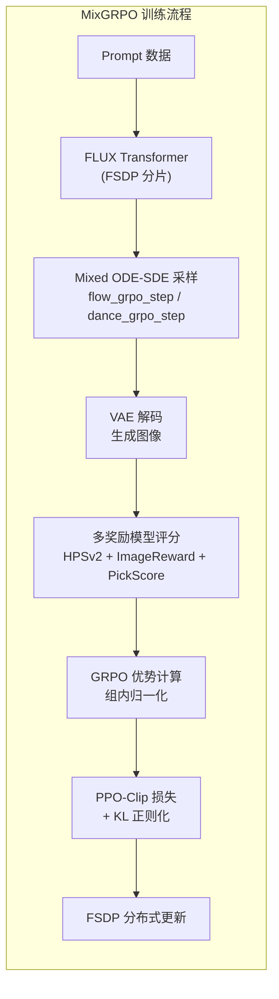
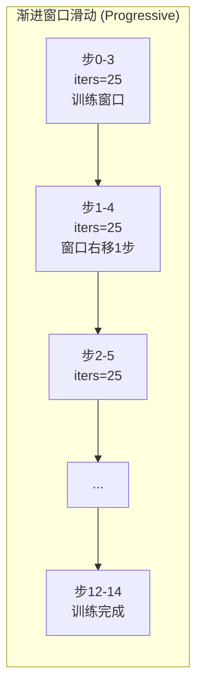

# MixGRPO 核心代码深度分析

> **论文**: *MixGRPO: Unlocking Flow-based GRPO Efficiency with Mixed ODE-SDE*
> **来源**: Tencent Hunyuan & Peking University | 基于 DanceGRPO + FastVideo 框架

---

## 一、项目概览

MixGRPO 的核心创新在于：将扩散采样过程分为 **SDE（随机微分方程）** 和 **ODE（常微分方程）** 两段，仅在 SDE 段计算策略梯度，ODE 段则用更高效的 DPMSolver 加速采样。配合**渐进式滑动窗口**调度策略，大幅提升 Flow-based GRPO 的训练效率。



### 项目结构

| 文件 | 行数 | 核心职责 |
|------|------|----------|
| `fastvideo/train_grpo_flux.py` | 1569 | 主训练入口：采样、优势计算、PPO 损失、参数更新 |
| `fastvideo/utils/sampling_utils.py` | 693 | ODE/SDE 采样核心：flow_grpo_step, dance_grpo_step, DPMSolver |
| `fastvideo/utils/grpo_states.py` | 215 | 渐进滑动窗口：时间步调度策略管理 |
| `fastvideo/utils/communications_flux.py` | 346 | 分布式通信：序列并行 AllToAll/AllGather |
| `fastvideo/utils/fsdp_util.py` | 137 | FSDP 配置：分片策略、混合精度、激活检查点 |
| `fastvideo/utils/checkpoint.py` | 315 | 检查点管理：FSDP 分布式存/取 |
| `fastvideo/utils/parallel_states.py` | 67 | 序列并行分组状态管理 |
| `fastvideo/models/reward_model/utils.py` | 127 | 多奖励并行计算 + 融合 |

---

## 二、核心算法实现

### 2.1 训练策略：`part` vs `all`

MixGRPO 通过 `--training_strategy` 参数区分两种训练模式：

```python
# train_grpo_flux.py L1326-1328
parser.add_argument("--training_strategy", type=str,
    choices=["part", "all"],
    help="training strategy, part means MixGRPO, all means DanceGRPO")
```

| 模式 | 含义 | 训练时间步 | 采样方式 |
|------|------|-----------|---------|
| `part` (MixGRPO) | 渐进窗口训练 | 每步仅训练窗口内的 `group_size` 个时间步 | SDE 段随机 + ODE 段确定性 |
| `all` (DanceGRPO) | 全时间步训练 | 训练所有 `sampling_steps` 个时间步 | 全部采用 SDE |

### 2.2 Mixed ODE-SDE 采样 — `run_sample_step()`

采样过程的核心在于根据 `determistic[i]` 标志决定每个时间步使用 ODE 还是 SDE：

```python
# sampling_utils.py L25-101
if grpo_sample:
    all_latents = [z]
    all_log_probs = []

for i in progress_bar:
    # ① 模型推理得到速度场预测
    pred = transformer(hidden_states=z, timestep=timesteps/1000, ...)
    
    # ② 根据 determistic 标志选择步进方式
    if args.flow_grpo_sampling:  # MixGRPO 模式
        z, pred_original, log_prob, mean, std = flow_grpo_step(
            model_output=pred,
            latents=z,
            eta=args.eta,
            sigmas=sigma_schedule,
            index=i,
            determistic=determistic[i],  # ← 关键：True=ODE, False=SDE
            sde_type=args.sde_type,
            noise_level=args.noise_level,
        )
    else:  # DanceGRPO 模式
        z, pred_original, log_prob = dance_grpo_step(
            pred, z, args.eta, sigma_schedule, i,
            sde_solver=(not determistic[i]),  # SDE 开关
        )
```

**`determistic` 列表的构建**（`sample_reference_model()` L238-243）：

```python
if args.training_strategy == "part":
    determistic = [True] * sample_steps    # 默认全部 ODE（确定性）
    for i in timesteps_train:              # 仅窗口内时间步设为 SDE
        determistic[i] = False
elif args.training_strategy == "all":
    determistic = [False] * sample_steps   # 全部 SDE
```

### 2.3 flow_grpo_step：SDE 与 CPS 两种噪声模式

```python
# sampling_utils.py L161-235
def flow_grpo_step(model_output, latents, eta, sigmas, index, prev_sample,
                   determistic=False, sde_type="sde", noise_level=None):
    sigma = sigmas[index]
    sigma_prev = sigmas[index + 1]
    dt = sigma_prev - sigma  # 负的时间步长
```

#### 模式 A: SDE（标准反向 SDE）

```python
if sde_type == "sde":
    # 噪声标准差 ∝ √(σ/(1-σ)) * η
    std_dev_t = sqrt(σ / (1 - σ)) * η
    
    # 原始样本预测
    x₀ = z - σ · v_θ(z, t)
    
    # SDE 均值项（drift + score 修正）
    mean = z · (1 + std²/(2σ) · dt) + v_θ · (1 + std² · (1-σ)/(2σ)) · dt
    
    # SDE 采样：mean + std · √(-dt) · ε
    prev_sample = mean + std · √(-dt) · ε
    
    # 确定性模式退化为 ODE（Euler 步）
    if determistic:
        prev_sample = z + dt · v_θ
    
    # 对数概率（高斯对数似然）
    log_prob = -‖(prev_sample - mean)²‖ / (2·(std·√(-dt))²) - log(std·√(-dt)) - log(√(2π))
```

#### 模式 B: CPS（Coefficients-Preserving Sampling）

```python
if sde_type == "cps":
    # CPS 独特的噪声调度
    std_dev_t = σ_prev · sin(noise_level · π/2)   # 默认 noise_level=0.8
    
    # 分离预测
    x₀ = z - σ · v_θ
    noise_estimate = z + v_θ · (1 - σ)
    
    # CPS 均值
    mean = x₀ · (1 - σ_prev) + noise_estimate · √(σ_prev² - std²)
```

> **关键区别**：SDE 模式的噪声与当前 σ 相关，CPS 模式的噪声与 σ_prev 相关且使用三角函数调度，提供更原则性的采样。

### 2.4 dance_grpo_step：DanceGRPO 原始采样

```python
# sampling_utils.py L237-301
def dance_grpo_step(model_output, latents, eta, sigmas, index, prev_sample,
                    grpo, sde_solver, sde_type="sde", noise_level=None):
    # SDE 模式
    if sde_type == "sde":
        mean = z + dt · v_θ                       # ODE 均值
        std = η · √(σ - σ_prev)                   # 噪声标准差
        
        if sde_solver:
            # SDE 修正：加入 score 估计
            score = -(z - x₀·(1-σ)) / σ²
            mean += -0.5 · η² · score · dt         # drift 修正
            prev_sample = mean + std · ε
        else:
            prev_sample = mean                     # 纯 ODE 步
```

> **与 flow_grpo_step 对比**：dance_grpo_step 的噪声 `std = η·√(Δσ)` 更简单；flow_grpo_step 的噪声 `std = η·√(σ/(1-σ))` 根据信噪比动态调整，在高噪声区域（σ→1）注入更多随机性。

### 2.5 DPMSolver 多阶求解器

MixGRPO 集成了 DPMSolver 作为 ODE 段的高效求解器，支持 1-3 阶：

```python
# sampling_utils.py L321-433
def dpm_step(args, model_output, sample, step_index, timesteps, sigmas,
             dpm_state=None, generator=None, sde_solver=False):
    
    # 将模型输出转换为 x₀ 预测
    model_output = convert_model_output(model_output, sample, sigmas, step_index)
    # x₀ = z - σ · v_θ
    
    # 根据阶数选择对应求解器
    if order == 1 or lower_order:
        x_t = dpm_solver_first_order_update(...)      # DDIM 等价
    elif order == 2:
        x_t = multistep_dpm_solver_second_order_update(...)  # 二阶（midpoint/heun）
    else:
        x_t = multistep_dpm_solver_third_order_update(...)   # 三阶
```

**DPM 应用策略**（`--dpm_apply_strategy`）：

| 策略 | 含义 | 应用范围 |
|------|------|---------|
| `null` | 不使用 DPMSolver | 全部用 flow_grpo_step / dance_grpo_step |
| `all` | 全时间步使用 DPMSolver | 每步都用 DPMSolver（SDE/ODE 由 determistic 控制） |
| `post` | 仅 SDE 后使用 DPMSolver | SDE 窗口内用 flow_grpo_step，窗口后用 DPMSolver ODE 加速 |

**MixGRPO Flash 模式** (post 策略)：

```python
# sampling_utils.py L44-54
# 计算 ODE 段的压缩时间步
num_post_steps = max((total_steps - last_sde_step) * compress_ratio, 1)
# 重建 ODE 段的 sigma schedule
post_sigma_schedule = linspace(σ[last_sde+1], 0, num_post_steps)
sigma_schedule = cat([σ[:last_sde+1], post_sigma_schedule])
```

---

## 三、渐进滑动窗口调度 — `GRPOTrainingStates`

### 3.1 核心概念



### 3.2 四种时间步调度策略

| 策略 | `--sample_strategy` | 描述 |
|------|---------------------|------|
| **Progressive** | `progressive` | 窗口从时间步 0 开始，每隔 `iters_per_group` 次迭代向右滑动 |
| **Random** | `random` | 每步随机选择一个起始时间步 |
| **Decay** | `decay` | 类似 progressive 但 iters_per_group 随 timestep 线性衰减 |
| **Exp Decay** | `exp_decay` | iters_per_group = base × exp(-k × ReLU(t - threshold)) |

```python
# grpo_states.py — 核心状态更新
class GRPOTrainingStates:
    iters_per_group: int    # 每组迭代次数（滑动间隔）
    group_size: int         # 窗口大小
    max_timesteps: int      # 最大时间步 = sampling_steps - 2
    cur_timestep: int       # 当前窗口起始位置
    
    def update_iteration(self):
        self.cur_iter_in_group += 1
        if self.cur_iter_in_group >= self.iters_per_group:
            self.cur_iter_in_group = 0
            if self.prog_overlap:
                self.cur_timestep += self.prog_overlap_step  # 重叠滑动
            else:
                self.cur_timestep += self.group_size         # 无重叠跳跃
    
    def get_current_timesteps(self) -> List[int]:
        return list(range(self.cur_timestep,
                          min(self.cur_timestep + self.group_size, self.max_timesteps)))
```

### 3.3 默认训练脚本配置

```bash
# finetune_flux_grpo_MixGRPO.sh 默认参数
sampling_steps=25          # 总采样步数
group_size=4               # 窗口大小 = 4 个时间步
iters_per_group=25         # 每窗口训练 25 次
sample_strategy="progressive"
prog_overlap_step=1        # 重叠滑动步长 = 1
roll_back=True             # 到达末尾后回到起点重新训练
```

滑动过程：`[0,1,2,3]` → 25次 → `[1,2,3,4]` → 25次 → ... → `[19,20,21,22]` → 回到 `[0,1,2,3]`

---

## 四、多奖励融合系统

### 4.1 支持的奖励模型

| 模型 | 类名 | 评估维度 |
|------|------|---------|
| HPSv2 | `HPSClipRewardModel` | 人类偏好分数 |
| ImageReward | `ImageRewardModel` | 图像质量评估 |
| PickScore | `PickScoreRewardModel` | 人类选择偏好 |
| CLIP Score | `CLIPScoreRewardModel` | 文图一致性 |
| Unified Reward | `UnifiedRewardModel` | 统一 API 奖励（语义/美学） |

### 4.2 两种融合策略

```python
# --multi_reward_mix 参数
```

**策略 A: `reward_aggr`（奖励加权聚合）**
```
reward_total = Σ(weight_i × reward_i)  # 先加权合并奖励
advantage = (reward_total - mean) / std  # 再计算优势
```

**策略 B: `advantage_aggr`（优势分别聚合）** ⭐ 默认
```
for each reward_model:
    advantage_i = (reward_i - mean_i) / std_i  # 每个模型独立归一化
advantage_total = Σ(weight_i × advantage_i)    # 加权合并优势
```

> **优势聚合更优**：各奖励模型的数值范围差异很大（如 HPS ∈ [0.2, 0.3], CLIP ∈ [20, 30]），先独立归一化再聚合可以避免某个模型主导训练。

### 4.3 组内优势计算

```python
# train_grpo_flux.py L430-481
if args.use_group:
    # 每 num_generations 个样本为一组（来自同一 prompt）
    for i in range(n_prompts):
        group_rewards = rewards[i*K : (i+1)*K]  # K=12 (num_generations)
        
        # 可选：Trimmed Mean（去除极端值）
        if args.trimmed_ratio > 0:
            sorted_rewards = sort(group_rewards)
            trim_size = int(K * trimmed_ratio)
            group_mean = sorted_rewards[trim_size:].mean()
            group_std = sorted_rewards[trim_size:].std() + 1e-8
        else:
            group_mean = group_rewards.mean()
            group_std = group_rewards.std() + 1e-8
        
        advantages[i*K:(i+1)*K] = (group_rewards - group_mean) / group_std
```

---

## 五、PPO-Clip 训练损失

### 5.1 损失计算

```python
# train_grpo_flux.py L545-586
for i, sample in enumerate(samples_batched_list):
    for _ in train_timesteps:
        # ① 用当前策略重新计算 log_prob
        new_log_probs = grpo_one_step(args, latents, next_latents, ...)
        
        # ② 优势裁剪
        advantages = clamp(sample["advantages"], -adv_clip_max, adv_clip_max)
        
        # ③ PPO-Clip 损失
        ratio = exp(new_log_probs - old_log_probs)
        unclipped = -advantages * ratio
        clipped = -advantages * clamp(ratio, 1-ε, 1+ε)  # ε=1e-4
        policy_loss = mean(max(unclipped, clipped))
        
        # ④ KL 散度正则化
        kl_loss = 0.5 * mean((new_log_probs - old_log_probs)²)
        
        # ⑤ 总损失
        loss = policy_loss + kl_coeff * kl_loss
        loss /= (gradient_accumulation_steps * len(train_timesteps))
        loss.backward()
```

### 5.2 关键超参数

| 参数 | 默认值 | 含义 |
|------|--------|------|
| `clip_range` | 1e-4 | PPO ratio 裁剪范围（非常保守） |
| `adv_clip_max` | 5.0 | 优势值上界 |
| `kl_coeff` | 0.0 | KL 正则系数（默认关闭） |
| `eta` | 0.7 | SDE 噪声强度 |
| `num_generations` | 12 | 每 prompt 生成图片数 |
| `gradient_accumulation_steps` | 3 | 梯度累积步数 |
| `learning_rate` | 1e-5 | 学习率 |
| `max_grad_norm` | 1.0 | 梯度裁剪范数 |
| `shift` | 3.0 | 时间步调度偏移 (SD3 time shift) |

---

## 六、与 DanceGRPO / Flow-GRPO 的关键区别

| 维度 | DanceGRPO | Flow-GRPO | MixGRPO |
|------|-----------|-----------|---------|
| **采样方式** | 全步 SDE | 全步 SDE | SDE 窗口 + ODE 加速 |
| **噪声公式** | `std = η·√(Δσ)` | `std = η·√(σ/(1-σ))` | flow_grpo_step (同 Flow-GRPO) |
| **训练时间步** | 全部 | 全部 | 滑动窗口子集 |
| **ODE 加速** | ❌ | ❌ | ✅ DPMSolver post 策略 |
| **CPS 支持** | ❌ | ❌ | ✅ `--sde_type=cps` |
| **多奖励** | 单一 | 单一 | 多模型 advantage_aggr |
| **训练框架** | Accelerate DDP | Accelerate + FSDP | torchrun + FSDP |
| **默认分辨率** | 512-1024 | 512-1024 | 720×720 |
| **典型 GPU 数** | 8 卡 | 8-32 卡 | 32 卡 (4×8) |
| **drop_last_sample** | True | False | False |

---

## 七、数据流总结

```mermaid
sequenceDiagram
    participant DS as DataLoader
    participant TF as FLUX Transformer<br/>(FSDP)
    participant VAE as VAE Decoder
    participant RM as Reward Models<br/>(并行)
    participant OPT as Optimizer

    DS->>TF: prompt embeddings (batch=1, repeat K=12)
    
    Note over TF: 采样阶段 (torch.no_grad)
    loop 25 sampling steps
        TF->>TF: flow_grpo_step / dance_grpo_step
        Note right of TF: determistic[i]→ODE/SDE
    end
    TF->>VAE: latents → 解码图像
    VAE->>RM: 图像 + prompt
    RM->>RM: HPS + IR + PickScore (线程池并行)
    RM-->>TF: rewards (K,)
    
    Note over TF: AllGather rewards 跨 GPU
    Note over TF: 组内优势归一化
    
    Note over TF: 训练阶段
    loop 窗口内时间步
        TF->>TF: grpo_one_step → new_log_prob
        TF->>TF: PPO-Clip loss + KL loss
        TF->>OPT: loss.backward()
    end
    OPT->>TF: optimizer.step() (每 gradient_accum 步)
    Note over TF: AllReduce gradients (FSDP)
```

---

## 八、代码质量与设计评价

### 优点
1. **Mixed ODE-SDE 设计精巧**：通过 `determistic` 列表灵活控制每步的采样类型
2. **多奖励 advantage_aggr 策略**：解决了不同奖励尺度不一致的问题
3. **渐进窗口调度**：多种策略（progressive/decay/exp_decay）可灵活应对训练需求
4. **CPS 采样支持**：提供比标准 SDE 更原则性的噪声注入方案
5. **DPMSolver Flash 模式**：ODE 段时间步压缩 (`compress_ratio=0.4`)，显著加速

### 局限
1. **全参数微调**：不支持 LoRA，显存占用大（需 32 卡 80GB）
2. **无参考模型 KL 约束**：`kl_coeff=0.0`，仅依赖 PPO clip 防止策略漂移
3. **不支持 resume_from_checkpoint**：训练中断需完全重启
4. **多节点依赖 pdsh/hostfile**：配置复杂度高于 Accelerate
