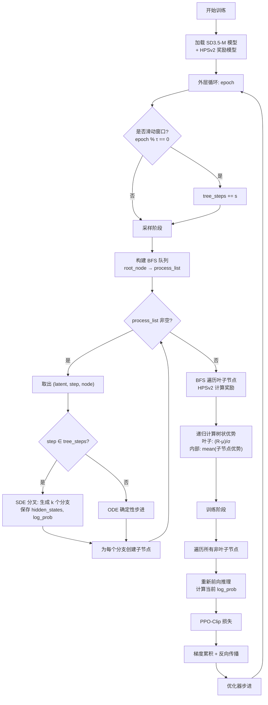

# TreeGRPO 项目代码深度分析

> **论文**: TreeGRPO: Tree-Advantage GRPO for Online RL Post-Training of Diffusion Models (ICLR 2026)
> **核心创新**: 将树状优势估计（Tree-Advantage Estimation）引入扩散模型的 GRPO 训练，通过在去噪过程的关键步骤进行 SDE 分叉，构建树状采样结构，大幅降低显存消耗并增强优势估计的准确性。

---

## 一、项目目录结构

```
TreeGRPO-main/
├── train.py                           # 主训练脚本（527行），包含 RLTrainer 类
├── dataset.py                         # 数据集类（32行），TextPromptDataset
├── prompts.txt                        # HPDv2 prompt 数据集（9.3MB）
├── requirements.txt                   # 依赖项
├── configs/
│   └── base.yaml                      # Hydra 配置文件（50行）
├── pipelines_with_logprob/
│   ├── __init__.py
│   └── stablediffusion3.py            # 树状推理 Pipeline（331行）
├── reward_models/
│   ├── __init__.py
│   └── hps.py                         # HPSv2 奖励模型（61行）
└── schedulers_with_logprob/
    ├── __init__.py
    └── flow_match_euler_discrete.py   # ODE/SDE 调度器 + log_prob（95行）
```

---

## 二、逐文件详细分析

### 2.1 `configs/base.yaml` — 配置文件

```yaml
training:
  epochs: 300             # 训练轮数
  batch_size: 1           # 训练 batch_size（固定为1，因为每个节点独立训练）
  lr: 1e-5                # 学习率
  max_grad_norm: 1.0      # 梯度裁剪
  mixed_precision: "bf16" # 混合精度
  enable_cfg: true        # 启用 Classifier-Free Guidance
  adv_clip_max: 5         # 优势裁剪上限
  clip_range: 1e-4        # PPO clip 范围
  inner_epochs: 1         # 内部训练轮数
  gradient_accumulation_steps: 8

sample:
  num_inference_steps: 10   # 去噪步数
  guidance_scale: 4.5       # CFG 强度
  num_prompts: 1            # 每 GPU 每 epoch 的 prompt 数
  num_trees: 1              # 每个 prompt 的 tree 数
  noise_level: 0.7          # SDE 噪声水平
  fixed_initial_noise: false

tree:
  enable: true              # 启用树状结构
  w: 4                      # 窗口大小（分叉步数）
  k: 2                      # 每个分叉点的分支数
  s: 1                      # 窗口滑动步长
  tou: 50                   # 窗口切换频率（epoch）
  use_ode: true             # 非分叉步用 ODE
  loss_agg: "sum"           # loss 聚合方式
```

**关键参数关系**：
- 每 epoch 图像数 = $k^w \times \text{num\_trees} \times \text{num\_prompts}$ = $2^4 \times 1 \times 1 = 16$
- 训练样本数 = $\frac{k^w - 1}{k - 1} \times \text{num\_trees} \times \text{num\_prompts}$ = $\frac{15}{1} \times 1 = 15$

---

### 2.2 `dataset.py` — 数据加载

```python
class TextPromptDataset(Dataset):
    """从文本文件加载 prompt，每行一个"""
    def __init__(self, file_path, max_length=None):
        # 逐行读取 prompt，跳过空行
    def __len__(self): return len(self.prompts)
    def __getitem__(self, idx): return self.prompts[idx]
```

极简设计，仅负责读取 prompt 文本文件。

---

### 2.3 `reward_models/hps.py` — HPSv2 奖励模型

```python
class HPS_v2:
    def __init__(self, device):
        # 加载 ViT-H-14 CLIP 模型 + HPSv2 checkpoint
        self.model = create_model_and_transforms('ViT-H-14', ...)
        checkpoint = torch.load("./hps_ckpt/HPS_v2.1_compressed.pt")
        self.model.load_state_dict(checkpoint['state_dict'])
    
    def __call__(self, img, text):
        # 计算图像-文本对齐分数
        image_features @ text_features.T → hps_score
        return hps_score  # shape: (1,)
```

**工作流程**：
1. 使用 CLIP ViT-H-14 提取图像和文本特征
2. 计算余弦相似度作为奖励分数
3. 单张图像单次评分，逐一给树的叶子节点打分

---

### 2.4 `schedulers_with_logprob/flow_match_euler_discrete.py` — 核心 SDE 采样

这是 TreeGRPO 最核心的文件之一，实现了 ODE→SDE 转换和 log probability 计算。

```python
def flow_match_euler_discrete_step_with_logprob(
    self, model_output, timestep, sample,
    prev_sample=None,         # 若为 None 则生成新样本
    noise_level=0.7,          # 噪声强度
    tree_k=1,                 # 分支数（1=不分叉）
    use_ode=False,            # 是否用 ODE（确定性步）
):
```

**核心数学公式**：

1. **ODE 模式** (use_ode=True)：
   $$x_{t-1} = x_t + dt \cdot v_\theta(x_t, t)$$
   返回 `[sample + dt * model_output], [None]`

2. **SDE 模式** (use_ode=False)：
   - 标准差：$\sigma_t = \sqrt{\frac{\sigma}{1-\sigma}} \cdot \text{noise\_level}$
   - 均值：$\mu = x_t(1 + \frac{\sigma_t^2}{2\sigma}dt) + v_\theta(1 + \frac{\sigma_t^2(1-\sigma)}{2\sigma})dt$
   - 噪声标准差：$\text{std} = \sigma_t \sqrt{-dt}$
   - 采样：$x_{t-1} = \mu + \text{std} \cdot \epsilon, \quad \epsilon \sim \mathcal{N}(0, I)$

3. **Log Probability 计算**：
   $$\log p(x_{t-1} | x_t) = -\frac{(x_{t-1} - \mu)^2}{2 \cdot \text{std}^2} - \log(\text{std}) - \frac{1}{2}\log(2\pi)$$

4. **树分叉**：当 `tree_k > 1` 时，对同一个均值 $\mu$ 生成 `tree_k` 个不同的噪声采样，形成分支。

---

### 2.5 `pipelines_with_logprob/stablediffusion3.py` — 树状推理 Pipeline

#### TreeOutput 类 — 树节点数据结构

```python
class TreeOutput:
    hidden_states         # 输入 latent（非叶子节点才有）
    timestep              # 当前时间步
    encoder_hidden_states # 文本编码
    children = []         # 子节点列表
    parent               # 父节点
    output_latents = []   # 输出 latent（非叶子）
    log_prob = []         # 该步的 log probability（非叶子）
    image                 # 最终解码图像（仅叶子节点）
    reward                # 奖励分数（仅叶子）
    advantage             # 优势值
```

#### sd3_pipeline_with_logprob — 树状推理主函数

**核心逻辑（BFS 树形推理）**：

```python
root_node = TreeOutput(parent=None)
process_list = [(latents, 0, root_node)]  # BFS 队列

while process_list:
    latents, i, node = process_list.pop(0)
    t = timesteps[i]
    
    # 1. 保存当前节点的输入状态（用于训练回放）
    if i in tree_steps and use_ode:
        node.hidden_states = latents.detach()
        node.timestep = t
        node.encoder_hidden_states = prompt_embeds
        node.pooled_projections = pooled_prompt_embeds
    
    # 2. Transformer 前向推理
    noise_pred = self.transformer(hidden_states=latent_model_input, ...)
    
    # 3. CFG
    noise_pred = uncond + guidance * (text - uncond)
    
    # 4. SDE/ODE 步进 + 分叉
    latents, log_probs = flow_match_euler_discrete_step_with_logprob(
        ...,
        tree_k=tree_k if i in tree_steps else 1,   # 仅在 tree_steps 分叉
        use_ode=tree_use_ode and i not in tree_steps # 非分叉步用 ODE
    )
    
    # 5. 为每个分支创建子节点
    for latent, log_prob in zip(latents, log_probs):
        new_node = TreeOutput(parent=node)
        node.children.append(new_node)
        process_list.append((latent, i+1, new_node))
    
    # 6. 叶子节点：VAE 解码
    if i == len(timesteps) - 1:
        node.image = vae.decode(latents)
```

---

### 2.6 `train.py` — 主训练脚本

#### RLTrainer 类结构

| 方法 | 功能 |
|------|------|
| `__init__` | 加载模型、奖励模型、优化器、创建 DataLoader |
| `calculate_rewards` | BFS 遍历树，给叶子节点打分 |
| `update_advantages` | 递归计算归一化优势值 |
| `sample` | 采样阶段：生成树、计算奖励、计算优势 |
| `treegrpo_update` | PPO-Clip 损失计算 |
| `train` | 训练阶段：遍历树节点、反向传播 |
| `save_model` | 保存检查点 |
| `run` | 主训练循环 |

#### 关键方法详解

**1. `calculate_rewards` — 奖励计算**
```
BFS 遍历树 → 找到所有叶子节点 → 调用 HPS_v2 打分
返回所有叶子的奖励列表
```

**2. `update_advantages` — 树状优势估计（核心创新）**
```python
def update_advantages(self, node, mean, std):
    if node.image:  # 叶子节点
        node.advantage = [(reward - mean) / std]
        return advantage
    else:  # 内部节点
        advs = [self.update_advantages(child) for child in node.children]
        node.advantage = advs
        return mean(advs)  # 传播平均优势给父节点
```

**关键设计**：叶子节点的优势 = 归一化奖励，内部节点的优势 = 子节点优势的平均。这使得每个分叉步的梯度都能得到来自所有后续分支的信号。

**3. `treegrpo_update` — PPO-Clip 损失**
```python
ratio = exp(log_prob_new - log_prob_old)
unclipped_loss = -advantages * ratio
clipped_loss = -advantages * clamp(ratio, 1-ε, 1+ε)
loss = mean(max(unclipped_loss, clipped_loss))
```

**4. `train` — 训练循环**
```
遍历树的所有非叶子节点 → 重新计算当前策略的 log_prob → 
PPO-Clip 更新 → 梯度累积 → 优化器步进
```

**5. `run` — 外层循环**
```
for epoch in dataloader:
    # 动态滑动 tree 窗口
    if epoch % tou == 0: tree_steps += s
    
    # 采样
    all_inputs = self.sample(batch_prompts)
    
    # 训练
    self.train(all_inputs)
    
    # 保存
    if epoch % save_freq == 0: self.save_model(epoch)
```

---

## 三、训练流程图



---

## 四、训练细节总结

| 项目 | 配置 |
|------|------|
| 基础模型 | Stable Diffusion 3.5 Medium |
| 优化器 | AdamW, lr=1e-5, weight_decay=1e-4 |
| 混合精度 | bf16 |
| 去噪步数 | 10 步 |
| 树参数 | w=4 步分叉, k=2 分支/步, 共 $2^4=16$ 张图 |
| 奖励模型 | HPSv2 (ViT-H-14 CLIP) |
| 训练策略 | PPO-Clip, clip_range=1e-4, adv_clip=5 |
| 分辨率 | 512×512 |
| 窗口滑动 | 每 50 epoch 滑动 1 步 |
| 梯度累积 | 8 步 |

**核心特点**：
1. **树状结构共享计算**：前缀路径只推理一次，通过分叉复用
2. **动态窗口**：随训练进行逐步将分叉点推迟到后期步骤
3. **仅在 tree_steps 使用 SDE**：非分叉步用 ODE 确定性步进，节省计算
4. **叶子奖励回传**：优势从叶子向根递归平均，每步都有梯度信号
