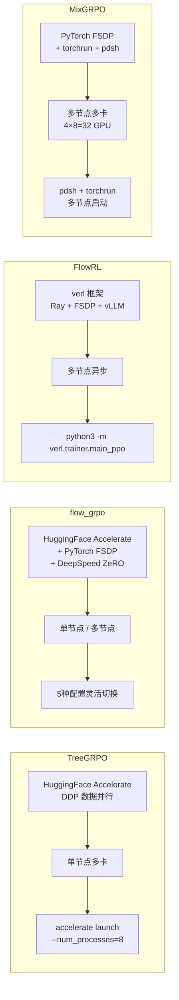
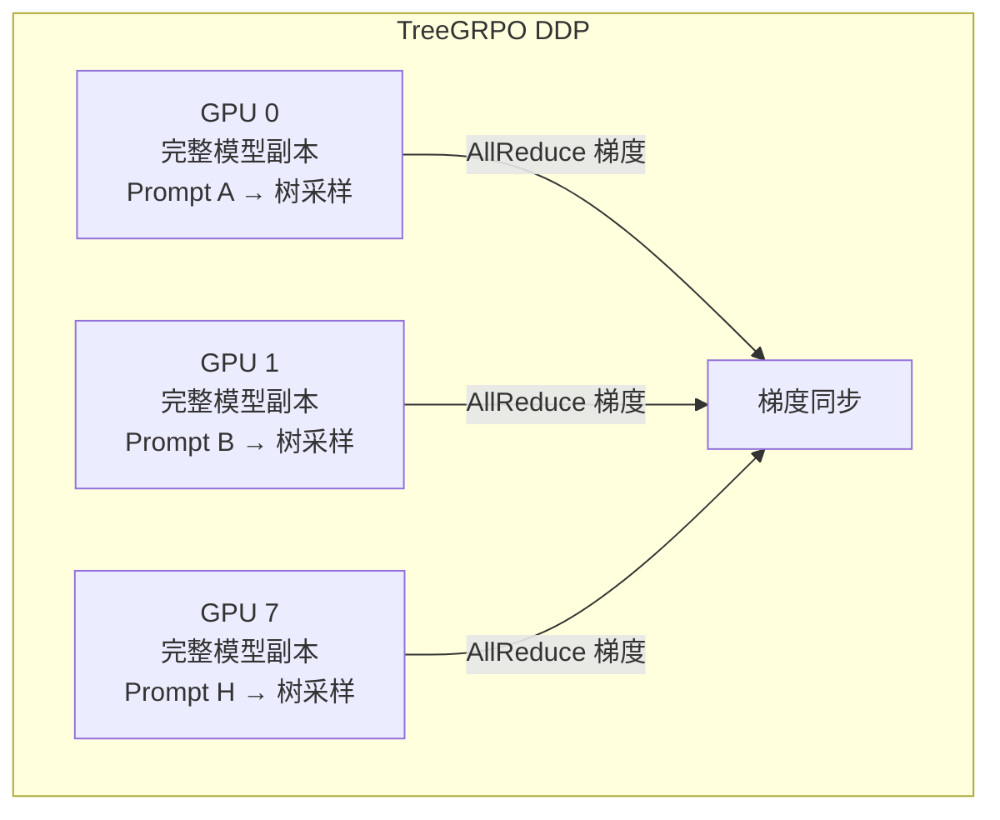
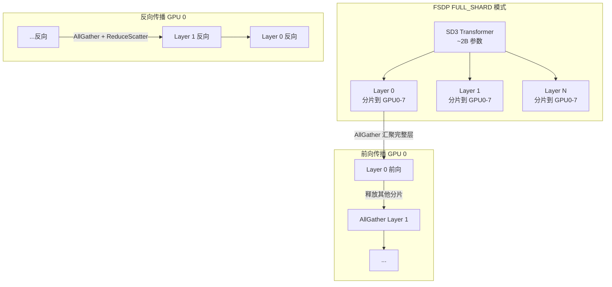
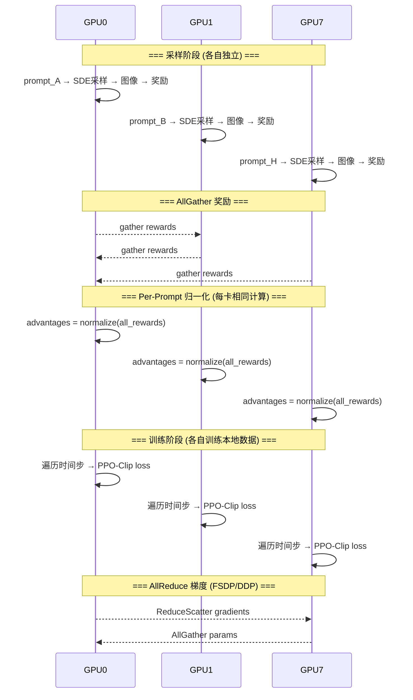
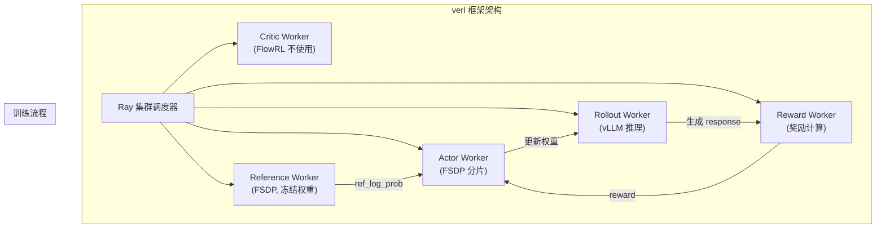
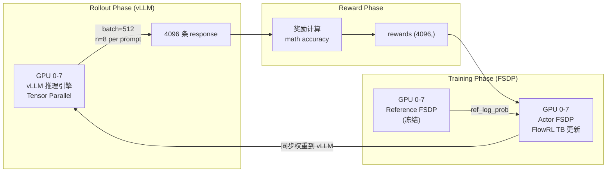
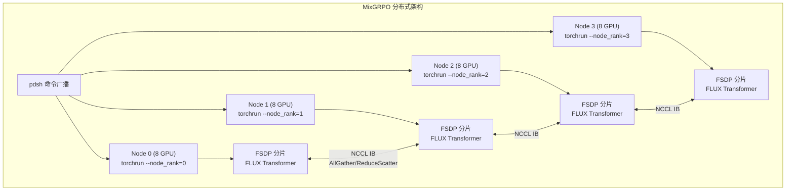
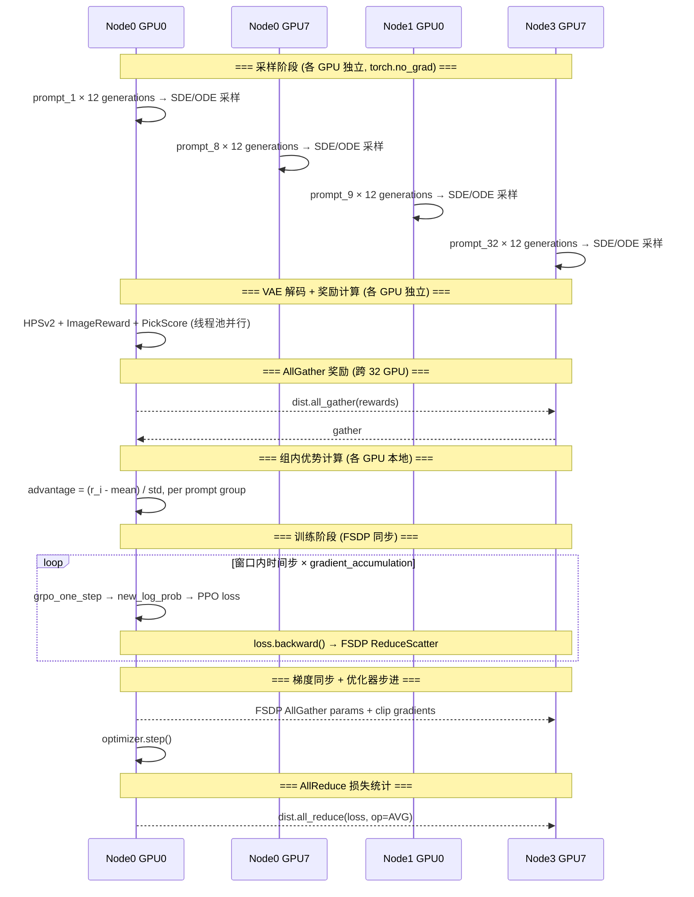

# Diffusion RL 项目分布式训练框架深度分析

> 本文档深入分析 TreeGRPO、flow_grpo、FlowRL、**MixGRPO** 四个项目使用的代码框架、GPU 并行计算策略、分布式训练方案和显存优化技术。

---

## 一、四个项目的框架选型对比



| 维度 | TreeGRPO | flow_grpo | FlowRL | MixGRPO |
|------|----------|-----------|--------|---------|
| **核心框架** | Accelerate (DDP) | Accelerate + FSDP/DeepSpeed | verl (Ray + FSDP + vLLM) | PyTorch FSDP + torchrun |
| **并行策略** | 数据并行 DDP | 数据并行 + 模型分片 | Actor-Critic 分离调度 | FSDP 模型分片 + 序列并行 |
| **典型 GPU 数** | 1-8 卡 | 1-32 卡 | 8-64 卡 | **32 卡 (4×8)** |
| **多节点** | 不支持 | 支持（NCCL） | 原生支持（Ray） | **pdsh + torchrun (NCCL IB)** |
| **显存优化** | 梯度检查点 | FSDP分片+CPU卸载+梯度检查点 | FSDP+vLLM+tensor并行 | **FSDP分片+梯度检查点+bf16** |
| **模型分片** | 无 | FULL_SHARD | FULL_SHARD | **FULL_SHARD / HYBRID** |
| **推理引擎** | diffusers 原生 | diffusers 原生 | vLLM 独立进程 | **diffusers 原生** |
| **适用模型** | SD3.5-M | SD3/Flux/WAN | Qwen/DeepSeek LLM | **FLUX.1-Dev (~12B)** |
| **微调方式** | 全参数 | LoRA r=32 | LoRA | **全参数 (fp32 master)** |

---

## 二、TreeGRPO：最简 Accelerate DDP

### 2.1 框架架构

TreeGRPO 使用最基础的 HuggingFace Accelerate，核心就是 **DDP（DistributedDataParallel）+ 混合精度**：

```python
# train.py 第 25-43 行
class RLTrainer:
    def __init__(self, config, accelerator, ...):
        self.accelerator = accelerator
        
        # 混合精度推理
        if accelerator.mixed_precision == "bf16":
            self.inference_dtype = torch.bfloat16
        
        # 模型加载到各自 GPU
        self.pipe = StableDiffusion3Pipeline.from_pretrained(...)
        self.pipe.transformer.enable_gradient_checkpointing()  # 显存优化
        self.pipe.transformer.requires_grad_(True)  # 全参数微调
```

### 2.2 启动方式

```bash
# README.md 记录的启动命令
accelerate launch --num_processes=8 train.py \
    training.epochs=300 \
    training.batch_size=1 \
    sample.num_trees=1
```

### 2.3 GPU 通信模式



**设计特点**：
- 每张 GPU 持有**完整模型副本**，独立处理不同 prompt
- 每张 GPU 独立构建 $k^w = 16$ 张图的树
- 仅在反向传播时通过 AllReduce 同步梯度
- **优势**：代码极简，无复杂分片逻辑
- **劣势**：显存受限于单卡容量，无法训练超大模型

### 2.4 显存优化

TreeGRPO 仅使用了一种显存优化手段：

```python
# 梯度检查点（Activation Checkpointing）
self.pipe.transformer.enable_gradient_checkpointing()
```

以时间换空间：前向传播不保存中间激活值，反向传播时重新计算。

---

## 三、flow_grpo：全方位 Accelerate + FSDP + DeepSpeed

### 3.1 5种并行配置

flow_grpo 提供了 5 种灵活的 Accelerate 配置文件：

#### 配置 1: `multi_gpu.yaml` — 基础多 GPU DDP
```yaml
distributed_type: MULTI_GPU
mixed_precision: fp16
num_machines: 1
num_processes: 8          # 8 卡 DDP
```
最简单配置，每卡复制完整模型。

#### 配置 2: `fsdp.yaml` — PyTorch FSDP 全分片 ⭐
```yaml
distributed_type: FSDP
fsdp_config:
    fsdp_auto_wrap_policy: TRANSFORMER_BASED_WRAP  # 按 Transformer 层分片
    fsdp_backward_prefetch: BACKWARD_PRE           # 反向传播预取下一层
    fsdp_forward_prefetch: true                    # 前向传播预取
    fsdp_offload_params: false                     # 不卸载到 CPU
    fsdp_sharding_strategy: FULL_SHARD             # 完全分片
    fsdp_use_orig_params: true                     # 保留原始参数名
    fsdp_activation_checkpointing: true            # 梯度检查点
mixed_precision: bf16
num_processes: 2
```

#### 配置 3: `deepspeed_zero2.yaml` — DeepSpeed ZeRO Stage 2
```yaml
distributed_type: DEEPSPEED
deepspeed_config:
    zero_stage: 2                   # 优化器状态 + 梯度分片
    offload_optimizer_device: none  # 不卸载优化器到 CPU
    offload_param_device: none      # 不卸载参数到 CPU
num_processes: 8
```

#### 配置 4: `multi_node.yaml` — 多节点
```yaml
distributed_type: MULTI_GPU
main_process_ip: '10.82.139.22'    # 主节点 IP
main_process_port: 19500
num_machines: 2
num_processes: 16                   # 2x8 GPU
rdzv_backend: static
```

#### 配置 5: `deepspeed_zero1.yaml` — ZeRO Stage 1
仅分片优化器状态，最低通信开销。

### 3.2 FSDP 核心代码 (`fsdp_utils.py`)

```python
class FSDPConfig:
    """FSDP 配置封装"""
    sharding_strategy = "FULL_SHARD"    # 完全分片策略
    backward_prefetch = "BACKWARD_PRE"  # 预取优化
    cpu_offload = False                 # CPU 卸载开关
    num_replicate = 1                   # Hybrid Shard 复制数
    num_shard = 8                       # 分片数
    mixed_precision_dtype = torch.bfloat16
    use_activation_checkpointing = True
    use_device_mesh = False             # 用于 Hybrid Shard 的 device mesh
```

**FSDP Wrapper 工作原理**：



```python
def fsdp_wrapper(model, fsdp_config, get_transformer_layer_cls):
    """将模型包装为 FSDP"""
    
    # Hybrid Shard: 节点内分片，节点间复制
    if fsdp_config.sharding_strategy == 'HYBRID_SHARD' and fsdp_config.use_device_mesh:
        device_mesh = init_device_mesh(
            "cuda", 
            mesh_shape=(num_replicate, num_shard),  # 例如 (4节点, 8卡/节点)
            mesh_dim_names=("replicate", "shard")
        )
    
    fsdp_model = FSDP(
        model,
        # 按 Transformer 层自动分片
        auto_wrap_policy=transformer_auto_wrap_policy(
            transformer_layer_cls=get_transformer_layer_cls()
        ),
        mixed_precision=MixedPrecision(
            param_dtype=bf16, reduce_dtype=bf16, buffer_dtype=bf16
        ),
        sharding_strategy=ShardingStrategy.FULL_SHARD,
        backward_prefetch=BackwardPrefetch.BACKWARD_PRE,
        cpu_offload=CPUOffload(offload_params=False),
        use_orig_params=True,  # LoRA 兼容必须
    )
    
    # 梯度检查点
    if use_activation_checkpointing:
        apply_activation_checkpointing(fsdp_model, ...)
    
    return fsdp_model
```

### 3.3 优化器 CPU 卸载 (`OptimizerOffloadHook`)

flow_grpo 实现了一个精巧的**优化器状态 CPU 卸载**机制：

```python
class OptimizerOffloadHook:
    """优化器步进前后将状态在 GPU/CPU 间搬运"""
    
    def pre_step_hook(self, optimizer, args, kwargs):
        """优化器步进前：CPU → GPU"""
        for param in params:
            for key, cpu_tensor in self.cpu_states[param].items():
                state[key] = cpu_tensor.to(param.device, non_blocking=True)
    
    def post_step_hook(self, optimizer, args, kwargs):
        """优化器步进后：GPU → CPU"""
        for param in params:
            for key, tensor in state.items():
                self.cpu_states[param][key] = tensor.to('cpu', non_blocking=True)
                state[key] = torch.empty(0, device=param.device)  # 释放 GPU
```

**效果**：AdamW 的 momentum 和 variance 两个缓冲区（与参数同样大小）只在 optimizer.step() 时短暂加载到 GPU，其余时间存在 CPU 内存中。对于 2B 参数模型，可节省约 **16GB 显存**。

### 3.4 多节点启动脚本

```bash
# scripts/multi_node/sd3.sh
export NCCL_IB_DISABLE=0    # 启用 InfiniBand（高速互连）
export NCCL_IB_HCA=mlx5     # 指定 RDMA 设备
export NCCL_DEBUG=WARN
export NCCL_IB_GID_INDEX=3  # GID 索引

accelerate launch --config_file scripts/accelerate_configs/multi_node.yaml \
    --num_machines 4 --num_processes 32 \             # 4节点 × 8卡
    --machine_rank ${RANK} \                          # 当前节点编号
    --main_process_ip ${MASTER_ADDR} \                # 主节点 IP
    --main_process_port ${MASTER_PORT} \
    scripts/train_sd3.py --config config/grpo.py:geneval_sd3
```

### 3.5 训练代码中的关键分布式操作

```python
# train_sd3.py 中的分布式关键点

# 1. Accelerator 初始化（核心！）
accelerator = Accelerator(
    mixed_precision=config.mixed_precision,
    # 梯度累积 = 样本累积步 × 时间步数
    gradient_accumulation_steps=config.train.gradient_accumulation_steps * num_train_timesteps,
)

# 2. 模型/优化器/数据包装
transformer, optimizer, train_dataloader, test_dataloader = accelerator.prepare(
    transformer, optimizer, train_dataloader, test_dataloader
)

# 3. K-Repeat 分布式采样器（每 GPU 不同 prompt）
train_sampler = DistributedKRepeatSampler(
    dataset=train_dataset,
    batch_size=config.sample.train_batch_size,
    k=config.sample.num_image_per_prompt,
    num_replicas=accelerator.num_processes,  # GPU 总数
    rank=accelerator.process_index,           # 当前 GPU 编号
    seed=42
)

# 4. 跨 GPU 汇聚奖励（AllGather）
gathered_rewards = {
    key: accelerator.gather(value)  # 每个 GPU 的奖励汇聚到所有 GPU
    for key, value in samples["rewards"].items()
}

# 5. Per-Prompt 归一化需要全局数据
# 先 gather 所有 GPU 的 prompt_ids，再解码
prompt_ids = accelerator.gather(samples["prompt_ids"]).cpu().numpy()
prompts = pipeline.tokenizer.batch_decode(prompt_ids, skip_special_tokens=True)

# 6. 全局归一化后，按 GPU 编号取回本地优势
advantages = advantages.reshape(
    accelerator.num_processes, -1, advantages.shape[-1]
)[accelerator.process_index]

# 7. 梯度累积 + 同步
with accelerator.accumulate(transformer):  # 自动管理梯度累积
    loss = compute_loss(...)
    accelerator.backward(loss)             # 分布式反向
    if accelerator.sync_gradients:         # 梯度同步时裁剪
        accelerator.clip_grad_norm_(transformer.parameters(), max_grad_norm)
    optimizer.step()
    optimizer.zero_grad()
```

### 3.6 GPU 通信模式图



---

## 四、FlowRL：verl 框架 (Ray + FSDP + vLLM)

### 4.1 verl 架构概览

FlowRL 不直接使用 Accelerate，而是基于字节跳动的 **verl** 框架（RL for LLM 的专用框架）：



### 4.2 启动方式

```bash
# command/training/math/flowrl_7B_math.sh
python3 -m verl.trainer.main_ppo \
    algorithm.adv_estimator=grpo \
    data.train_batch_size=512 \
    data.max_prompt_length=2048 \
    data.max_response_length=8192 \
    \
    # Actor FSDP 配置
    actor_rollout_ref.actor.fsdp_config.param_offload=False \
    actor_rollout_ref.actor.fsdp_config.optimizer_offload=False \
    actor_rollout_ref.model.enable_gradient_checkpointing=True \
    \
    # Rollout vLLM 配置
    actor_rollout_ref.rollout.tensor_model_parallel_size=1 \    # tensor 并行
    actor_rollout_ref.rollout.gpu_memory_utilization=0.6 \      # GPU 显存占比
    actor_rollout_ref.rollout.n=8 \                             # 每 prompt 生成 8 条回复
    \
    # Reference 配置
    actor_rollout_ref.ref.fsdp_config.param_offload=False \
    \
    # 集群配置
    trainer.n_gpus_per_node=8 \
    trainer.nnodes=1 \          # 节点数
    trainer.total_epochs=1
```

### 4.3 Actor-Rollout-Reference 分离

verl 框架的核心设计是将**训练 (Actor)** 和**推理 (Rollout)** 分开：



**关键区别**：
- **Rollout**（推理阶段）使用 **vLLM** —— 高效推理引擎，支持 PagedAttention、continuous batching
- **Training**（训练阶段）使用 **FSDP** —— 模型参数分片到多卡上
- 两者共享 GPU，但交替执行，通过 **权重同步** 衔接

### 4.4 权重同步机制

FlowRL 修改了 `fsdp_vllm.py`，在 FSDP 训练完一轮后将更新的权重同步到 vLLM：

```python
# verl/workers/sharding_manager/fsdp_vllm.py
# 训练后同步到 vLLM
loaded_params = model.load_weights(
    (name, param.to(device).full_tensor() 
     if isinstance(param, DTensor) else param)
    for name, param in updated_params.items()
    if not name.startswith("proj_z")  # 跳过 proj_z（vLLM 不需要）
)
```

### 4.5 FlowRL 特有的 FSDP 配置

```bash
# 训练脚本中的 FSDP 配置
actor_rollout_ref.actor.fsdp_config.param_offload=False    # 参数不卸载到 CPU
actor_rollout_ref.actor.fsdp_config.optimizer_offload=False # 优化器不卸载
actor_rollout_ref.ref.fsdp_config.param_offload=False       # 参考模型也不卸载
actor_rollout_ref.model.enable_gradient_checkpointing=True  # 梯度检查点
```

---

## 五、显存占用分析

### 5.1 Diffusion Model (SD3.5-M ~2.5B params) 显存预算

| 组件 | 大小 | 优化后 |
|------|------|--------|
| Transformer 参数 (bf16) | ~5 GB | FSDP 分片: 5/N GB/卡 |
| VAE + Text Encoder (冻结) | ~3 GB | 3 GB/卡（不分片） |
| LoRA 可训练参数 | ~0.1 GB | 0.1 GB/卡 |
| AdamW 优化器状态 | ~0.4 GB | CPU卸载: 0 GB/卡 |
| 梯度 | ~0.2 GB | 0.2 GB/卡 |
| 激活值（无检查点） | ~15 GB | 梯度检查点: ~3 GB |
| 采样中间 latent | ~2 GB | 2 GB/卡 |
| 奖励模型 (CLIP/HPSv2) | ~2 GB | 2 GB/卡 |
| **总计 (单卡, 无优化)** | **~28 GB** | - |
| **总计 (8卡 FSDP + 优化)** | - | **~9 GB/卡** |

### 5.2 各项目显存优化策略对比

| 优化技术 | TreeGRPO | flow_grpo | FlowRL |
|---------|----------|-----------|--------|
| **LoRA 微调** | ❌ 全参数 | ✅ r=32 | ✅ LoRA |
| **梯度检查点** | ✅ | ✅ | ✅ |
| **FSDP 模型分片** | ❌ | ✅ FULL_SHARD | ✅ FULL_SHARD |
| **优化器 CPU 卸载** | ❌ | ✅ OptimizerOffloadHook | ❌ (可选) |
| **混合精度** | bf16 | fp16/bf16 | bf16 |
| **推理与训练分离** | ❌ | ❌ | ✅ vLLM |
| **Tensor 并行** | ❌ | ❌ | ✅ (vLLM rollout) |

---

## 六、DistributedKRepeatSampler — flow_grpo 的核心采样器

flow_grpo 设计了一个专门的分布式采样器来保证 Per-Prompt GRPO 的正确性：

```python
class DistributedKRepeatSampler:
    """分布式 K-重复采样器
    
    保证：同一个 prompt 生成的 K 张图片在同一张 GPU 上
    这样 Per-Prompt 归一化可以在本地计算
    """
    def __init__(self, dataset, batch_size, k, num_replicas, rank, seed):
        # batch_size: 每 GPU 的 prompt 数
        # k: 每个 prompt 生成的图片数
        # num_replicas: GPU 总数
        
        self.total_samples = batch_size * k * num_replicas
        self.m = self.total_samples // k  # 唯一 prompt 数
    
    def __iter__(self):
        # 1. 生成全局随机排列
        g = torch.Generator().manual_seed(self.seed + self.epoch)
        indices = torch.randperm(len(self.dataset), generator=g)[:self.m]
        
        # 2. 每个 prompt 重复 k 次
        indices = indices.repeat_interleave(self.k)
        
        # 3. 按 GPU 切分（关键！同 prompt 在同 GPU）
        per_card = indices.view(self.num_replicas, -1)
        yield per_card[self.rank]
```

**设计意图**：GRPO 需要同一 prompt 的多张图像来计算组内优势。如果 K 张图分散在不同 GPU，就需要额外通信汇聚。通过这个采样器，同 prompt 的 K 张图保持在同一 GPU 上。

---

## 七、梯度累积的特殊处理

flow_grpo 中梯度累积的设计非常精妙：

```python
# 关键：gradient_accumulation_steps = 样本累积 × 时间步数
accelerator = Accelerator(
    gradient_accumulation_steps=config.train.gradient_accumulation_steps * num_train_timesteps
)
```

**原因**：训练循环有双层嵌套——外层遍历样本，内层遍历时间步。每个时间步都做一次 `backward()`，但只有在完成所有时间步和指定的累积步数后才做 `optimizer.step()`。

```python
# 训练循环结构
for i, sample in enumerate(batches):           # 样本维度
    for j in range(num_train_timesteps):        # 时间步维度
        with accelerator.accumulate(transformer):  # 自动判断是否同步
            loss = compute_loss(j)
            accelerator.backward(loss)
            if accelerator.sync_gradients:      # 仅在累积完毕时
                clip_grad_norm_(...)
            optimizer.step()
            optimizer.zero_grad()
```

---

## 八、Z-AFT 推荐的分布式方案

基于以上分析，Z-AFT 项目推荐：

| 组件 | 方案 | 理由 |
|------|------|------|
| 框架 | HuggingFace Accelerate | 三个项目中最通用、最成熟 |
| 并行策略 | DDP (≤8卡) / FSDP (>8卡) | 按规模灵活切换 |
| 模型微调 | LoRA (r=32) | 显存友好，flow_grpo 验证有效 |
| 显存优化 | 梯度检查点 + 混合精度 bf16 | 基础必备 |
| 可选优化 | FSDP FULL_SHARD + Optimizer CPU Offload | 大模型 (Flux) 必需 |
| 采样器 | 自定义 TreeDistributedSampler | 保证同 prompt 的 27 分支在同 GPU |
| 梯度累积 | accumulate_steps × 分叉步数 | 适配树结构训练 |

```python
# Z-AFT 推荐的 Accelerator 初始化
accelerator = Accelerator(
    mixed_precision="bf16",
    gradient_accumulation_steps=gradient_accum * num_split_steps,  # 3 个分叉步
)

# Z-AFT 推荐的 FSDP 配置 (大模型场景)
# accelerate_configs/fsdp.yaml
distributed_type: FSDP
fsdp_config:
    fsdp_auto_wrap_policy: TRANSFORMER_BASED_WRAP
    fsdp_sharding_strategy: FULL_SHARD
    fsdp_activation_checkpointing: true
    fsdp_use_orig_params: true   # LoRA 兼容
mixed_precision: bf16
```

---

## 九、MixGRPO：torchrun + FSDP + pdsh 多节点

### 9.1 框架架构概览

MixGRPO **不使用 HuggingFace Accelerate**，而是直接基于 **PyTorch 原生 FSDP + torchrun** 构建分布式训练，用 `pdsh` 实现多节点命令广播。这种方式更底层但也更灵活。



### 9.2 多节点启动方式（pdsh + torchrun）

MixGRPO 使用 `pdsh`（Parallel Distributed Shell）将 torchrun 命令广播到所有节点：

```bash
# scripts/finetune/finetune_flux_grpo_MixGRPO.sh

# ① hostfile 定义节点 IP
hostfile="data/hosts/hostfile"         # 每行一个节点 IP

# ② 获取主节点 IP
CHIEF_IP_custom=$(head -n 1 $hostfile)

# ③ pdsh 广播到所有节点
pdsh -R ssh -w ^$hostfile "
    cd $cur_path ;
    conda activate MixGRPO ;
    
    # NCCL 环境变量(详见 9.3)
    export NCCL_IB_DISABLE=0 ;
    ...
    
    # ④ torchrun 启动分布式训练
    torchrun \
        --nnodes 4 \                    # 4 个节点
        --nproc_per_node 8 \            # 每节点 8 GPU
        --node_rank \$INDEX_CUSTOME \   # 节点编号（预设环境变量）
        --master_addr $CHIEF_IP_custom \
        --master_port $free_port \
        fastvideo/train_grpo_flux.py ...
"
```

**节点编号预设**（`set_env_multinode.sh`）：
```bash
# 在每个节点上预先设置 INDEX_CUSTOME=0,1,2,3
```

**与其他项目启动方式对比**：

| 项目 | 启动工具 | 节点发现 | 进程管理 |
|------|---------|---------|---------|
| TreeGRPO | `accelerate launch` | 单节点自动 | Accelerate |
| flow_grpo | `accelerate launch` | YAML 配置 IP | Accelerate |
| FlowRL | `verl.trainer.main_ppo` | Ray 集群 | Ray |
| **MixGRPO** | `pdsh + torchrun` | hostfile | **torchrun elastic** |

### 9.3 NCCL InfiniBand 高速互连配置

MixGRPO 的脚本包含了**最完整的 NCCL 调优配置**：

```bash
# NCCL InfiniBand 核心配置
export NCCL_IB_DISABLE=0              # ✅ 启用 InfiniBand
export NCCL_P2P_DISABLE=0             # ✅ 启用 P2P（GPU Direct RDMA）
export NCCL_IB_CUDA_SUPPORT=1         # ✅ GPU Direct RDMA
export NCCL_IB_GID_INDEX=3            # GID 索引（RoCE v2）
export NCCL_IB_SL=3                   # 服务级别（QoS）

# InfiniBand 设备指定（8 个 RDMA 设备对应 8 个 GPU）
export NCCL_IB_HCA=mlx5_bond_1,mlx5_bond_5,mlx5_bond_3,mlx5_bond_7,\
                    mlx5_bond_4,mlx5_bond_8,mlx5_bond_2,mlx5_bond_6

# 网络接口
export NCCL_SOCKET_IFNAME=bond1       # TCP fallback 网卡
export UCX_NET_DEVICES=bond1          # UCX 设备

# 性能调优
export NCCL_IB_QPS_PER_CONNECTION=4   # 每连接 QoS 队列数
export NCCL_IB_TC=160                 # 流量控制类
export NCCL_LL_THRESHOLD=16384        # 低延迟协议阈值
export NCCL_NET_GDR_LEVEL=2           # GPU Direct RDMA 级别

# 特性开关
export NCCL_COLLNET_ENABLE=0          # 关闭 In-Network Computing
export NCCL_PXN_DISABLE=1             # 关闭 PXN（节点间 NVLink）
export NCCL_NVLS_ENABLE=0             # 关闭 NVLink SHARP
export NCCL_CHECK_DISABLE=1           # 关闭校验（性能优化）
export SHARP_COLL_ENABLE_SAT=0        # 关闭 SHARP 硬件聚合
```

> **关键**：MixGRPO 面向的是配备 Mellanox ConnectX 网卡的 HPC 集群，通过 8 路 IB bonding 实现节点间 ~200Gbps 带宽。

### 9.4 FSDP 配置详解

```python
# fsdp_util.py — get_dit_fsdp_kwargs()
def get_dit_fsdp_kwargs(transformer, sharding_strategy, ...):
    # ① 获取不切分的 Transformer 层类
    no_split_modules = get_no_split_modules(transformer)
    
    # ② 按 Transformer 层自动分片
    auto_wrap_policy = transformer_auto_wrap_policy(
        transformer_layer_cls=no_split_modules,
    )
    
    # ③ 混合精度配置
    mixed_precision = MixedPrecision(
        param_dtype=torch.float32,    # ← 主权重保持 fp32!
        reduce_dtype=torch.float32,   # 梯度通信用 fp32
        buffer_dtype=torch.float32,   # buffer 用 fp32
    )
    
    # ④ 分片策略
    fsdp_kwargs = {
        "auto_wrap_policy": auto_wrap_policy,
        "mixed_precision": mixed_precision,
        "sharding_strategy": ShardingStrategy.FULL_SHARD,  # 默认
        "device_id": torch.cuda.current_device(),
        "limit_all_gathers": True,     # 限制 AllGather 并发，节省显存
    }
```

**MixGRPO 支持的分片策略**（`--fsdp_sharding_startegy`）：

| 策略 | 代码值 | 含义 |
|------|--------|------|
| `full` | `FULL_SHARD` | 参数+梯度+优化器全分片 |
| `hybrid_full` | `HYBRID_SHARD` | 节点内 FULL_SHARD，节点间复制 |
| `none` | `NO_SHARD` | 不分片（类似 DDP） |
| `hybrid_zero2` | `_HYBRID_SHARD_ZERO2` | 节点内 ZeRO-2，节点间复制 |

**特殊设计：fp32 主权重**

与 flow_grpo 使用 bf16 参数不同，MixGRPO **保持 fp32 主权重，仅在前向推理时使用 `torch.autocast("cuda", torch.bfloat16)`**：

```python
# train_grpo_flux.py L780-783
transformer = FluxTransformer2DModel.from_pretrained(
    args.pretrained_model_name_or_path,
    subfolder="transformer",
    torch_dtype=torch.float32    # ← fp32 主权重
)

# 训练时 autocast 为 bf16
with torch.autocast("cuda", torch.bfloat16):
    pred = transformer(hidden_states=latents, ...)  # bf16 前向
```

### 9.5 模型激活检查点

```python
# fsdp_util.py — apply_fsdp_checkpointing()
def apply_fsdp_checkpointing(model, no_split_modules, p=1):
    """
    p=1: 每层都做检查点；p=1/2: 每隔一层做检查点
    用 NON_REENTRANT 模式（更高效，兼容 FSDP）
    """
    block_idx = 0
    cut_off = 1 / 2
    p = eval(p) if isinstance(p, str) else p
    
    def selective_checkpointing(submodule):
        nonlocal block_idx, cut_off
        if isinstance(submodule, no_split_modules):
            block_idx += 1
            if block_idx * p >= cut_off:
                cut_off += 1
                return True
        return False
    
    apply_activation_checkpointing(
        model,
        checkpoint_wrapper_fn=non_reentrant_wrapper,
        check_fn=selective_checkpointing,
    )
```

### 9.6 序列并行（Sequence Parallel）

MixGRPO 继承了 FastVideo 的序列并行能力，通过 AllToAll 和 AllGather 通信原语实现：

```python
# parallel_states.py — 序列并行分组
def initialize_sequence_parallel_group(sp_size):
    """将 GPU 划分为序列并行组"""
    num_sp_groups = world_size // sp_size
    for i in range(num_sp_groups):
        ranks = range(i * sp_size, (i + 1) * sp_size)
        group = dist.new_group(ranks)

# communications_flux.py — AllToAll 通信
class SeqAllToAll4D(torch.autograd.Function):
    """QKV 重分布：将序列维度切分，头维度聚合"""
    @staticmethod
    def forward(ctx, group, input, scatter_idx, gather_idx):
        # scatter_idx=2 (head), gather_idx=1 (seq)
        # 输入: (B, S/P, H*P, D) → 输出: (B, S, H, D)
        ...

# communications_flux.py — 数据加载器包装
def sp_parallel_dataloader_wrapper(dataloader, device, batch_size, sp_size, sp_batch_size):
    """将数据加载器包装为序列并行版本
    - 广播 prompt embedding 到序列并行组内所有 GPU
    - 确保同组 GPU 看到相同 prompt
    """
```

> **注意**：MixGRPO 默认 `sp_size=1`（不启用序列并行），但保留了完整实现以支持超高分辨率场景。

### 9.7 检查点管理

```python
# checkpoint.py — 分布式检查点保存
def save_checkpoint(transformer, rank, output_dir, step, epoch):
    """使用 FSDP FULL_STATE_DICT 模式保存检查点
    
    - StateDictType.FULL_STATE_DICT: 在 rank=0 汇聚完整模型
    - offload_to_cpu=True: 汇聚到 CPU 内存，避免 GPU OOM
    - rank0_only=True: 仅 rank=0 执行实际保存
    - 格式: safetensors (高效序列化)
    """
    with FSDP.state_dict_type(
        transformer,
        StateDictType.FULL_STATE_DICT,
        FullStateDictConfig(offload_to_cpu=True, rank0_only=True),
    ):
        cpu_state = transformer.state_dict()
    
    if rank <= 0:
        save_file(cpu_state, f"{output_dir}/checkpoint-{step}-{epoch}/diffusion_pytorch_model.safetensors")
```

### 9.8 GPU 通信模式



### 9.9 与 flow_grpo FSDP 的关键差异

| 维度 | flow_grpo | MixGRPO |
|------|-----------|---------|
| **包装层** | Accelerate 封装 FSDP | 直接使用 PyTorch FSDP |
| **主权重精度** | bf16 | **fp32**（更高精度，更多显存） |
| **优化器卸载** | ✅ OptimizerOffloadHook | ❌ 不支持 |
| **微调方式** | LoRA (r=32) | **全参数微调** |
| **梯度累积** | Accelerate 自动管理 | **手动管理** (`(i+1)%accum==0`) |
| **奖励全局汇聚** | `accelerator.gather()` | `dist.all_gather()` |
| **损失同步** | Accelerate 自动 | `dist.all_reduce(loss, op=AVG)` |
| **检查点** | Accelerate `save_state()` | **FSDP FULL_STATE_DICT + safetensors** |
| **序列并行** | ❌ | ✅（预留实现，默认 sp=1） |
| **NCCL 调优** | 基础 IB 配置 | **完整 RDMA + bonding 配置** |

---

## 十、四项目显存优化综合对比（更新）

| 优化技术 | TreeGRPO | flow_grpo | FlowRL | MixGRPO |
|---------|----------|-----------|--------|---------|
| **LoRA 微调** | ❌ 全参数 | ✅ r=32 | ✅ LoRA | ❌ **全参数 fp32** |
| **梯度检查点** | ✅ | ✅ | ✅ | ✅ (可选 selective) |
| **FSDP 模型分片** | ❌ | ✅ FULL_SHARD | ✅ FULL_SHARD | ✅ **FULL/HYBRID** |
| **优化器 CPU 卸载** | ❌ | ✅ OptimizerOffloadHook | ❌ (可选) | ❌ |
| **混合精度** | bf16 | fp16/bf16 | bf16 | **fp32 权重 + bf16 推理** |
| **推理与训练分离** | ❌ | ❌ | ✅ vLLM | ❌ |
| **Tensor 并行** | ❌ | ❌ | ✅ (vLLM) | ❌ |
| **序列并行** | ❌ | ❌ | ❌ | ✅ (预留) |
| **NCCL IB 调优** | ❌ | 基础 | ❌ | ✅ **完整** |
| **limit_all_gathers** | - | - | - | ✅ |

---

## 十一、Z-AFT 推荐的分布式方案（更新）

基于以上四个项目的分析，Z-AFT 项目推荐：

| 组件 | 方案 | 参考项目 | 理由 |
|------|------|---------|------|
| 框架 | PyTorch FSDP + torchrun | MixGRPO | 最灵活，适合 FLUX 大模型 |
| 备选框架 | HuggingFace Accelerate | flow_grpo | 更简洁的 API 封装 |
| 并行策略 | FSDP FULL_SHARD | MixGRPO + flow_grpo | 12B 模型必需分片 |
| 模型微调 | LoRA (r=32) | flow_grpo | 显存友好；全参数仅在足够 GPU 时使用 |
| 显存优化 | 梯度检查点 + bf16 autocast | MixGRPO | 基础必备 |
| 可选优化 | Optimizer CPU Offload | flow_grpo | GPU 卡数不够时使用 |
| 多节点启动 | pdsh + torchrun | MixGRPO | 适合有 hostfile 的 HPC 集群 |
| NCCL 配置 | IB + RDMA 完整配置 | MixGRPO | 多节点高带宽必需 |
| 采样器 | 自定义 TreeDistributedSampler | flow_grpo 思路 | 保证同 prompt 的分支在同 GPU |
| 梯度累积 | 手动管理 | MixGRPO | 适配滑动窗口训练结构 |

