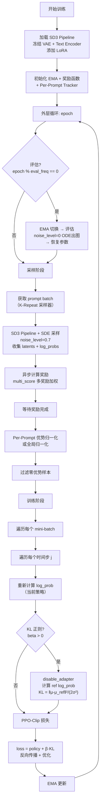

# flow_grpo 项目代码深度分析

> **项目全称**: Flow-GRPO — Flow Matching + Group Relative Policy Optimization for Diffusion Models
> **核心创新**: 将 Flow Matching 的 ODE→SDE 转换与 GRPO（PPO-Clip 风格）策略优化结合，支持 SD3/Flux/WAN 等多种模型，提供 SDE Window、Per-Prompt Stat Tracking、EMA、KL 正则化等完整工程方案。

---

## 一、项目目录结构

```
flow_grpo-main/
├── setup.py                              # 包安装配置
├── README.md                             # 详细使用指南（646行）
├── config/
│   ├── base.py                           # 基础配置（128行）
│   ├── grpo.py                           # 20+ 训练配置函数（1020行）
│   ├── dpo.py                            # DPO 配置
│   ├── sft.py                            # SFT 配置
│   └── grpo_guard.py                     # GRPO Guard 配置
├── flow_grpo/
│   ├── __init__.py
│   ├── rewards.py                        # 12种奖励函数（490行）
│   ├── stat_tracking.py                  # Per-Prompt 统计追踪（100行）
│   ├── ema.py                            # EMA 权重管理（100行）
│   ├── fsdp_utils.py                     # FSDP 工具函数
│   ├── prompts.py                        # Prompt 函数库
│   ├── aesthetic_scorer.py               # 美学评分器
│   ├── clip_scorer.py                    # CLIP 评分器
│   ├── imagereward_scorer.py             # ImageReward 评分器
│   ├── pickscore_scorer.py               # PickScore 评分器
│   ├── ocr.py                            # OCR 文本检测
│   ├── qwenvl.py                         # QwenVL 模型接口
│   ├── diffusers_patch/                  # 核心 Pipeline 修补
│   │   ├── sd3_pipeline_with_logprob.py  # SD3 Pipeline + log_prob（192行）
│   │   ├── sd3_sde_with_logprob.py       # SDE 步进 + log_prob（93行）
│   │   ├── sd3_pipeline_with_logprob_fast.py
│   │   ├── flux_pipeline_with_logprob.py
│   │   ├── wan_pipeline_with_logprob.py
│   │   └── ... (12个 pipeline 变体)
│   ├── bagel/                            # Bagel 多模态模型支持
│   └── assets/                           # 辅助资源
├── scripts/
│   ├── train_sd3.py                      # SD3 主训练脚本（969行）
│   ├── train_flux.py                     # Flux 训练脚本
│   ├── train_wan2_1.py                   # WAN2.1 视频训练
│   ├── train_sd3_dpo.py                  # SD3 DPO 训练
│   ├── train_sd3_sft.py                  # SD3 SFT 训练
│   ├── train_bagel.py                    # Bagel 训练
│   ├── accelerate_configs/               # Accelerate 配置
│   ├── single_node/                      # 单节点启动脚本
│   └── multi_node/                       # 多节点启动脚本
└── dataset/
    ├── drawbench/                        # DrawBench 数据集
    ├── geneval/                          # GenEval 数据集
    ├── pickscore/                        # PickScore 数据集
    └── ocr/                             # OCR 数据集
```

---

## 二、核心文件逐一分析

### 2.1 `config/base.py` — 基础配置（128行）

所有配置的基类，使用 `ml_collections.ConfigDict`：

| 配置组 | 关键参数 | 默认值 | 说明 |
|--------|---------|--------|------|
| General | `num_epochs` | 100000 | 训练轮数 |
| | `mixed_precision` | "fp16" | 混合精度 |
| | `use_lora` | True | 启用 LoRA |
| | `resolution` | 768 | 图像分辨率 |
| Sample | `num_steps` | 40 | 采样步数 |
| | `guidance_scale` | 4.5 | CFG 强度 |
| | `noise_level` | 0.7 | SDE 噪声水平 |
| | `sde_window_size` | 2 | SDE 窗口大小 |
| | `sde_window_range` | (0, 10) | SDE 窗口范围 |
| | `global_std` | True | 全局标准差归一化 |
| Train | `learning_rate` | 3e-4 | 学习率 |
| | `clip_range` | 1e-4 | PPO clip 范围 |
| | `adv_clip_max` | 5 | 优势裁剪 |
| | `beta` | 0.0 | KL 正则化系数 |
| | `timestep_fraction` | 1.0 | 训练步占比 |

### 2.2 `config/grpo.py` — GRPO 训练配置集（1020行）

包含 20+ 预定义训练配置函数，覆盖各种任务场景：

| 函数名 | 模型 | 奖励 | 特殊设置 |
|--------|------|------|----------|
| `sd3_pickscore` | SD3 | PickScore | 基准配置 |
| `sd3_geneval` | SD3 | GenEval | batch_size=4, k=4 |
| `sd3_ocr` | SD3 | OCR | global_std, noise=0.4 |
| `sd3_aesthetic` | SD3 | Aesthetic | clip_range=1e-4 |
| `flux_pickscore` | Flux | PickScore | 1024分辨率, steps=20 |
| `wan2_1_aesthetic` | WAN2.1 | Aesthetic | 视频模型 |
| `sd3_geneval_kl` | SD3 | GenEval | beta=0.01, KL正则 |

---

### 2.3 `flow_grpo/diffusers_patch/sd3_sde_with_logprob.py` — SDE 采样核心（93行）

这是整个项目最核心的文件，实现了 ODE→SDE 转换和 log probability 计算。

```python
def sde_step_with_logprob(
    self: FlowMatchEulerDiscreteScheduler,
    model_output, timestep, sample,
    noise_level=0.7,       # 噪声强度控制
    prev_sample=None,      # 训练时提供，用于计算 log_prob
    sde_type='sde',        # 'sde' 或 'cps'
):
```

**支持两种 SDE 类型**：

#### 类型 1: SDE（默认）

$$\sigma_t = \sqrt{\frac{\sigma}{1 - \sigma}} \cdot \text{noise\_level}$$

$$\mu = x_t \left(1 + \frac{\sigma_t^2}{2\sigma} dt\right) + v_\theta \left(1 + \frac{\sigma_t^2(1-\sigma)}{2\sigma}\right) dt$$

$$x_{t-1} = \mu + \sigma_t \sqrt{-dt} \cdot \epsilon, \quad \epsilon \sim \mathcal{N}(0, I)$$

$$\log p(x_{t-1} | x_t) = -\frac{(x_{t-1} - \mu)^2}{2(\sigma_t \sqrt{-dt})^2} - \log(\sigma_t \sqrt{-dt}) - \frac{1}{2}\log(2\pi)$$

#### 类型 2: CPS（Consistent Probability Sampler）

$$\hat{x}_0 = x_t - \sigma \cdot v_\theta, \quad \hat{x}_1 = x_t + v_\theta(1-\sigma)$$

$$\sigma_{\text{noise}} = \sigma_{t-1} \sin(\text{noise\_level} \cdot \pi/2)$$

$$\mu = \hat{x}_0(1-\sigma_{t-1}) + \hat{x}_1 \sqrt{\sigma_{t-1}^2 - \sigma_{\text{noise}}^2}$$

$$\log p \propto -(x_{t-1} - \mu)^2 \quad \text{（省略常数项）}$$

---

### 2.4 `flow_grpo/diffusers_patch/sd3_pipeline_with_logprob.py` — Pipeline（192行）

修补 StableDiffusion3Pipeline，在推理过程中收集 log probability：

```python
def pipeline_with_logprob(self, ...):
    # 标准 SD3 推理流程
    all_latents = [latents]  # 保存每步 latent
    all_log_probs = []       # 保存每步 log_prob
    
    for i, t in enumerate(timesteps):
        # Transformer 前向
        noise_pred = self.transformer(...)
        # CFG
        noise_pred = uncond + guidance * (text - uncond)
        # SDE 步进 + log_prob
        latents, log_prob, prev_latents_mean, std_dev_t = sde_step_with_logprob(...)
        all_latents.append(latents)
        all_log_probs.append(log_prob)
    
    # VAE 解码
    image = self.vae.decode(latents)
    return image, all_latents, all_log_probs
```

**关键设计**：`noise_level` 参数在采样时为 0.7（注入噪声），评估时为 0（纯 ODE，确定性出图）。

---

### 2.5 `flow_grpo/rewards.py` — 12种奖励函数（490行）

提供模块化的奖励系统，支持多奖励组合：

| 奖励函数 | 类型 | 用途 |
|---------|------|------|
| `jpeg_compressibility` | 简单 | JPEG 压缩率（越小越好） |
| `aesthetic_score` | CLIP | 美学评分 |
| `clip_score` | CLIP | 文图一致性 |
| `pickscore_score` | CLIP | PickScore 偏好评分 |
| `imagereward_score` | 多模态 | ImageReward 评分 |
| `ocr_score` | OCR | 文字渲染准确度 |
| `geneval_score` | QwenVL | GenEval 组合评估 |
| `image_similarity_score` | CLIP | 图像相似度（编辑任务） |

**核心组合函数 `multi_score`**：
```python
def multi_score(device, config):
    """根据 config 动态加载多个奖励函数，返回加权平均"""
    scorers = {}
    for name, weight in config.items():
        scorer = globals()[name](device)
        scorers[name] = (scorer, weight)
    
    def _fn(images, prompts, metadata, only_strict=False):
        all_rewards = {}
        weighted_sum = 0
        for name, (scorer, weight) in scorers.items():
            scores = scorer(images, prompts, metadata)
            all_rewards[name] = scores
            weighted_sum += weight * scores
        all_rewards['avg'] = weighted_sum
        return all_rewards, {}
    return _fn
```

---

### 2.6 `flow_grpo/stat_tracking.py` — Per-Prompt 统计追踪

```python
class PerPromptStatTracker:
    """为每个 prompt 维护独立的均值/方差统计"""
    def __init__(self, global_std=True):
        self.stats = {}  # {prompt: [reward_list]}
    
    def update(self, prompts, rewards):
        # 1. 按 prompt 分组
        # 2. 计算每组的 mean/std
        # 3. 优势 = (reward - group_mean) / group_std
        # 4. 若 global_std=True，使用全局 std 替代 group_std
        return advantages
```

**设计意图**：当同一 prompt 生成多张图时，仅在同一 prompt 内比较，避免不同难度 prompt 的奖励偏差。

---

### 2.7 `flow_grpo/ema.py` — EMA 模型管理

```python
class EMAModuleWrapper:
    """指数移动平均，降低训练不稳定性"""
    def __init__(self, params, decay=0.9, update_step_interval=8):
        self.shadow_params = [p.clone() for p in params]
        self.decay = decay
        self.interval = update_step_interval
    
    def step(self, params, global_step):
        if global_step % self.interval == 0:
            for shadow, param in zip(self.shadow_params, params):
                shadow.mul_(self.decay).add_(param.data, alpha=1-self.decay)
    
    def copy_ema_to(self, params, store_temp=True):
        """评估时将 EMA 参数复制到模型"""
    def copy_temp_to(self, params):
        """评估后恢复原始参数"""
```

---

### 2.8 `scripts/train_sd3.py` — SD3 主训练脚本（969行）

这是最核心的训练入口，结构如下：

#### 辅助类和函数

| 名称 | 行号 | 功能 |
|------|------|------|
| `TextPromptDataset` | 42-58 | 从文本文件加载 prompt |
| `GenevalPromptDataset` | 60-77 | 从 JSONL 加载 GenEval prompt |
| `DistributedKRepeatSampler` | 79-121 | K-重复分布式采样器 |
| `compute_text_embeddings` | 124-131 | 编码 prompt 为 embedding |
| `calculate_zero_std_ratio` | 133-167 | 统计零方差 prompt 比例 |
| `create_generator` | 169-178 | 基于 prompt hash 创建 RNG |
| `compute_log_prob` | 181-215 | 重新计算 log_prob（训练） |
| `eval` | 217-316 | 评估函数 |
| `save_ckpt` | 323-332 | 保存 checkpoint |

#### `main()` 函数详解（334-964行）

**阶段 1: 初始化 (334-598)**

```python
# 1. Accelerator 设置
accelerator = Accelerator(mixed_precision=config.mixed_precision,
    gradient_accumulation_steps=config.train.gradient_accumulation_steps * num_train_timesteps)

# 2. 模型加载
pipeline = StableDiffusion3Pipeline.from_pretrained(config.pretrained.model)
pipeline.vae.requires_grad_(False)         # 冻结 VAE
pipeline.text_encoder*.requires_grad_(False)  # 冻结文本编码器

# 3. LoRA 配置
target_modules = ["attn.add_k_proj", "attn.add_q_proj", "attn.add_v_proj",
                  "attn.to_add_out", "attn.to_k", "attn.to_out.0", 
                  "attn.to_q", "attn.to_v"]
lora_config = LoraConfig(r=32, lora_alpha=64, init_lora_weights="gaussian")

# 4. EMA 初始化
ema = EMAModuleWrapper(params, decay=0.9, update_step_interval=8)

# 5. 奖励函数
reward_fn = flow_grpo.rewards.multi_score(device, config.reward_fn)

# 6. 无限循环 DataLoader（DistributedKRepeatSampler）
```

**阶段 2: 采样 (608-712)**

```python
for i in range(config.sample.num_batches_per_epoch):
    # 1. 获取 prompt batch
    prompts = next(train_iter)
    
    # 2. 编码 prompt
    prompt_embeds, pooled = compute_text_embeddings(prompts, ...)
    
    # 3. Pipeline 推理（SDE 采样 + log_prob 收集）
    images, latents, log_probs = pipeline_with_logprob(
        pipeline, ..., noise_level=config.sample.noise_level)
    
    # 4. 异步计算奖励
    rewards = executor.submit(reward_fn, images, prompts, metadata)
    
    # 5. 存储采样数据
    samples.append({
        "latents": latents[:, :-1],      # 每步的输入 latent
        "next_latents": latents[:, 1:],  # 每步的输出 latent
        "log_probs": log_probs,          # 采样时的 log_prob
        "rewards": rewards,              # 奖励
    })
```

**阶段 3: 优势计算 (743-822)**

```python
# 1. Per-Prompt 归一化
if config.per_prompt_stat_tracking:
    advantages = stat_tracker.update(prompts, gathered_rewards)
else:
    advantages = (rewards - rewards.mean()) / (rewards.std() + 1e-4)

# 2. 沿时间步复制优势（每步共享同一优势）
advantages = advantages.unsqueeze(1).repeat(1, num_train_timesteps)

# 3. 过滤零优势样本（同 prompt 生成完全相同奖励时跳过）
mask = (advantages.abs().sum(dim=1) != 0)
samples = {k: v[mask] for k, v in samples.items()}
```

**阶段 4: 训练 (831-964)**

```python
for inner_epoch in range(config.train.num_inner_epochs):
    perm = torch.randperm(total_batch_size)
    samples = {k: v[perm] for k, v in samples.items()}
    
    for i, sample in enumerate(samples_batched):
        for j in range(num_train_timesteps):  # 遍历每个时间步
            with accelerator.accumulate(transformer):
                # 1. 重新计算当前策略的 log_prob
                _, log_prob, prev_mean, std = compute_log_prob(
                    transformer, pipeline, sample, j, embeds, pooled, config)
                
                # 2. KL 正则化（可选）
                if config.train.beta > 0:
                    with transformer.module.disable_adapter():
                        _, _, prev_mean_ref, _ = compute_log_prob(...)
                    kl_loss = ((prev_mean - prev_mean_ref)**2) / (2 * std**2)
                
                # 3. PPO-Clip 损失
                ratio = exp(log_prob - sample["log_probs"][:, j])
                unclipped = -advantages * ratio
                clipped = -advantages * clamp(ratio, 1-ε, 1+ε)
                policy_loss = mean(max(unclipped, clipped))
                
                # 4. 总损失
                loss = policy_loss + beta * kl_loss
                
                # 5. 反向传播
                accelerator.backward(loss)
                optimizer.step()
```

---

## 三、SDE Window 机制

flow_grpo 独特的 **SDE Window** 设计：

```python
# config.sample.sde_window_size = 2
# config.sample.sde_window_range = (0, 10)
```

- 仅在 `sde_window_range` 范围内的特定 `sde_window_size` 个时间步注入 SDE 噪声
- 其余步骤使用纯 ODE（确定性），不产生 log_prob
- **效果**：聚焦训练信号到关键步骤，减少噪声干扰

---

## 四、训练流程图



---

## 五、训练细节总结

| 项目 | 配置 |
|------|------|
| 支持模型 | SD3, SD3.5, Flux, WAN2.1, Bagel, QwenImage |
| 优化器 | AdamW, lr=3e-4, wd=1e-4 |
| LoRA | r=32, alpha=64, target=attention layers |
| 混合精度 | fp16 (SD3) / bf16 (Flux/WAN) |
| 采样步数 | 10-40 步（可配置） |
| SDE 类型 | sde / cps 可切换 |
| 奖励系统 | 多奖励加权组合 |
| Per-Prompt | 同 prompt 内归一化 |
| EMA | decay=0.9, interval=8 steps |
| KL 正则 | 可选, β=0.01, 基于 mean 差异 |
| 分布式 | Accelerate + FSDP |

**与 TreeGRPO 的关键区别**：
1. **没有树结构**：每个 prompt 独立生成多张图，通过 K-Repeat 采样器实现
2. **SDE Window**：仅对部分步骤注入 SDE 噪声（而非全部）
3. **多奖励组合**：支持 12 种奖励函数的加权组合
4. **KL 正则化**：通过 disable_adapter 计算参考策略，约束策略偏离
5. **EMA**：用 EMA 平滑的参数做评估
6. **更丰富的配置系统**：20+ 预定义配置覆盖各种任务
