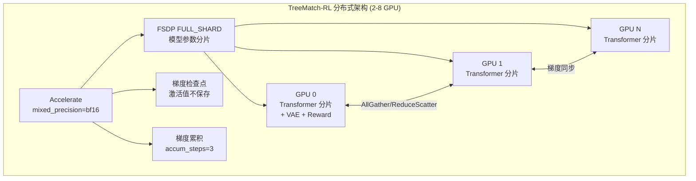

# TreeMatch-RL 详细实现方案

> **项目名称**: TreeMatch-RL (原 Z-AFT / Softmax-GRPO)
> **核心目标**: 将 GFlowNet 的 Softmax-TB 分布匹配与三阶树状采样、DPM-Solver++ Flash 加速、Beta 分布自适应调度深度融合，在有限 GPU 资源下高效训练扩散模型对齐。
> **论文标题**: *TreeMatch-RL: Tree-based Distribution Matching Online RL for Diverse and Efficient Diffusion Model Alignment*

---

## 一、噪声大小设计

### 1.1 数学基础：SDE 噪声注入公式

在 Flow Matching 框架下，ODE→SDE 转换的核心公式为：

$$\sigma_t = \sqrt{\frac{\sigma}{1 - \sigma}} \cdot \eta$$

SDE 步进采样：

$$x_{t-\Delta t} = \mu_\theta(x_t, t) + \sigma_t \sqrt{-dt} \cdot \epsilon, \quad \epsilon \sim \mathcal{N}(0, I)$$

$$\log \pi_\theta(x_{t-\Delta t} | x_t) = -\frac{\|x_{t-\Delta t} - \mu_\theta\|^2}{2 \sigma_t^2 (-dt)} - \frac{d}{2}\log(2\pi \sigma_t^2 (-dt))$$

### 1.2 三个分叉步的噪声系数设计

采用 **28 步去噪流程**（`num_inference_steps=28`），在三个关键时间步进行 SDE 分叉。

#### 推荐方案：**递增噪声** + **Beta分布自适应位置**

```python
# 基础噪声配置 (论文默认值)
tree_config = {
    "num_inference_steps": 28,               # 总采样步数
    "k": 3,                                  # 每步 3 分支 → 3^3 = 27 路径
    "base_noise_levels": [0.4, 0.7, 1.0],    # 递增噪声系数
    "kappa": 4.0,                            # Beta 分布集中度
    "beta_temperature": 15.0,                # Softmax-TB 温度 β
}
```

| 分叉层 | 默认索引 | 时间范围 | 噪声 η | 设计理由 |
|--------|---------|---------|--------|---------|
| 第 1 层 | step ~5 (t≈0.8) | 高噪声区 | 0.4 | 早期 latent 信噪比极低，σ/(1-σ) 本身很大，小 η 即产生足够差异 |
| 第 2 层 | step ~14 (t≈0.5) | 中噪声区 | 0.7 | 语义分化关键阶段，标准噪声平衡探索与稳定性 |
| 第 3 层 | step ~22 (t≈0.2) | 低噪声区 | 1.0 | 后期 latent 已基本成型，需要大噪声才能产生可区分的细节差异 |

**物理直觉**：$\sigma_t = \sqrt{\sigma/(1-\sigma)} \cdot \eta$ 中，$\sigma/(1-\sigma)$ 在 $t$ 大时本身很大、$t$ 小时接近 0。因此递增的 $\eta$ 在整个去噪过程中维持 **等效噪声强度的近似均匀分布**：

$$\text{effective\_noise} = \sqrt{\frac{\sigma}{1-\sigma}} \cdot \eta \approx \text{const}$$

### 1.3 Beta 分布自适应调度分叉位置

根据论文 §4.2，分叉位置由在线奖励均值 $\bar{R}$ 驱动的 Beta 分布采样决定：

```python
def compute_split_steps(mean_reward, R_min, R_max, kappa, num_steps, num_splits=3):
    """通过 Beta 分布计算自适应分叉位置
    
    Args:
        mean_reward: 组内奖励均值 (在线估计)
        R_min, R_max: 奖励经验边界 (用 EMA 维护)
        kappa: Beta 分布集中度 (默认 4.0)
        num_steps: 总采样步数 (28)
        num_splits: 分叉数 (3)
    
    Returns:
        split_steps: 排序后的分叉步索引列表, e.g. [4, 12, 20]
    """
    # 归一化奖励水平
    alpha = clip((mean_reward - R_min) / (R_max - R_min + 1e-8), 0, 1)
    
    # Beta 分布参数
    a = 1 + (1 - alpha) * kappa    # 低奖励 → a 大 → 分布右倾 → 早分叉
    b = 1 + alpha * kappa           # 高奖励 → b 大 → 分布左倾 → 晚分叉
    
    # 采样 3 个分叉点 (排序确保时间顺序)
    beta_dist = torch.distributions.Beta(a, b)
    split_fractions = beta_dist.sample((num_splits,)).sort().values  # [0,1] 区间
    
    # 映射到步骤索引 (避免首末步和重叠)
    # 最早不低于 step 2, 最晚不超过 step num_steps-3
    split_steps = (split_fractions * (num_steps - 5) + 2).long()
    
    # 确保相邻分叉步至少间隔 3 步 (ODE 段需要空间)
    for i in range(1, len(split_steps)):
        if split_steps[i] - split_steps[i-1] < 3:
            split_steps[i] = split_steps[i-1] + 3
    
    return split_steps.tolist()
```

**不同场景的行为**：

| 场景 | α | Beta(a,b) | E[t_split] | 分叉步示例 | 效果 |
|------|---|-----------|-----------|----------|------|
| 低奖励 (α→0) | 0 | Beta(5,1) | ~0.83 | [18, 21, 24] | 早分叉 → 全局结构重塑 |
| 中奖励 (α=0.5) | 0.5 | Beta(3,3) | ~0.50 | [6, 14, 22] | 均匀分布 |
| 高奖励 (α→1) | 1 | Beta(1,5) | ~0.17 | [3, 6, 9] | 晚分叉 → 保护语义，微调细节 |
| κ=0 (基线) | - | Uniform | 0.50 | 随机 | 无自适应 |

### 1.4 噪声系数也随难度自适应（进阶）

```python
def adaptive_noise_levels(alpha, base_levels=[0.4, 0.7, 1.0]):
    """根据难度水平 alpha 微调噪声系数
    
    低奖励 (难题): 增大噪声 → 更多探索
    高奖励 (易题): 减小噪声 → 更精细调整
    """
    # 难度缩放因子
    scale = 1.0 + (1.0 - alpha) * 0.3 - alpha * 0.2
    # scale: 难题 ~1.3, 易题 ~0.8, 中间 ~1.0
    
    return [clip(eta * scale, 0.2, 1.5) for eta in base_levels]
```

---

## 二、动态采样策略

### 2.1 整体采样流程

```
时间轴 t: 1.0 ──────────────────────────────────────── 0.0
          ┌─────────┬──────────┬──────────┬──────────┐
          │ ODE 段  │ SDE 分叉1 │ ODE/DPM  │ SDE 分叉2 │ ...
          │(Euler)  │ η₁=0.4   │(DPM-2nd) │ η₂=0.7   │ ...
          │ 共享主干 │ 1→3 分支  │ 共享计算  │ 3→9 分支  │ ...
          └─────────┴──────────┴──────────┴──────────┘

总路径结构:
    Root (1)
    ├── ODE 步进 (步 0 → split₁)         ← Euler ODE，共享主干
    ├── SDE 分叉₁ (split₁)                ← 3 个独立噪声
    │   ├── Branch A ─── ODE/DPM 步进 ──── SDE 分叉₂ ──── ...
    │   ├── Branch B ─── ODE/DPM 步进 ──── SDE 分叉₂ ──── ...
    │   └── Branch C ─── ODE/DPM 步进 ──── SDE 分叉₂ ──── ...
    ...
    最终: 27 条路径 → VAE 解码 → 奖励模型评分
```

### 2.2 核心采样函数：`determistic` 标志构建

借鉴 MixGRPO 的核心设计，用 `determistic` 列表控制每步是 ODE（确定性）还是 SDE（随机性）：

```python
def build_determistic_flags(total_steps, split_steps):
    """构建采样标志列表
    
    Args:
        total_steps: 总采样步数 (28)
        split_steps: 分叉步索引 [s1, s2, s3]
    
    Returns:
        determistic: List[bool], 长度为 total_steps
            True  = ODE 步进 (确定性，不注入噪声)
            False = SDE 步进 (随机性，注入噪声，产生分叉)
    """
    determistic = [True] * total_steps  # 默认全部 ODE
    for s in split_steps:
        determistic[s] = False           # 仅分叉步使用 SDE
    return determistic
```

### 2.3 DPM-Solver++ Flash 加速策略（借鉴 MixGRPO Flash）

**核心思想**：最后一个 SDE 分叉步之后的 ODE 段，不再逐步 Euler 步进，而是用 DPM-Solver++ 二阶压缩加速。

```python
def build_dpm_flash_schedule(total_steps, split_steps, compress_ratio=0.4):
    """构建 DPM-Solver++ Flash 加速的 sigma schedule
    
    MixGRPO Flash 的关键思想:
        - SDE 窗口内: 逐步采样 (保留梯度信号)
        - SDE 窗口后: DPM-Solver++ 压缩时间步 (加速推理)
    
    适配到 TreeMatch-RL:
        - 分叉步之间的 ODE 段: 正常 Euler 步进 (保持前缀共享的准确性)
        - 最后一个分叉步之后的所有 ODE 步: DPM-Solver++ 压缩
    
    Args:
        total_steps: 总采样步数 (28)
        split_steps: 分叉步索引 [s1, s2, s3]
        compress_ratio: ODE 尾段压缩比 (0.4 = 只用 40% 的步数)
    
    Returns:
        sigma_schedule: 重建后的 sigma schedule (用于 DPM 采样)
        use_dpm: List[bool], 每步是否使用 DPM-Solver++ 而非 Euler
    """
    last_split = max(split_steps)
    remaining_steps = total_steps - last_split - 1  # 最后分叉步之后的步数
    
    if remaining_steps <= 2:
        # 剩余步太少, 不压缩
        return None, [False] * total_steps
    
    # DPM 压缩后的步数
    dpm_steps = max(int(remaining_steps * compress_ratio), 1)
    
    # 构建使用标志
    use_dpm = [False] * total_steps
    
    # 重建 sigma schedule:
    # [原始 σ_0 ... σ_last_split] + [DPM 压缩后的 σ 序列]
    original_sigmas = original_sigma_schedule[:last_split + 2]  # 到最后分叉步+1
    dpm_sigmas = torch.linspace(
        original_sigma_schedule[last_split + 1],  # 从最后分叉步之后开始
        0.0,                                       # 到 t=0
        dpm_steps + 1                              # dpm_steps 个区间
    )
    
    new_sigma_schedule = torch.cat([original_sigmas, dpm_sigmas[1:]])
    
    # 标记 DPM 段
    for i in range(last_split + 1, last_split + 1 + dpm_steps):
        use_dpm[i] = True
    
    return new_sigma_schedule, use_dpm
```

### 2.4 完整的采样流程函数

```python
def tree_sample_reference_model(
    transformer, vae, text_embeddings, args,
    split_steps, noise_levels, reward_models,
    sigma_schedule, use_dpm_flags,
):
    """TreeMatch-RL 的完整树状采样流程
    
    Returns:
        all_paths: List of 27 dicts, each containing:
            - latents_history: List[Tensor], 每步的 latent
            - log_probs: List[float], SDE 步的 log_prob (ODE 步为 0)
            - reward: float, 终端奖励
            - advantages: float, 关联的优势值
    """
    device = next(transformer.parameters()).device
    B = text_embeddings.shape[0]  # batch_size (通常为 1)
    
    # ═══════════════════════════════════════════
    # 阶段 0: 初始化 — 纯噪声起点
    # ═══════════════════════════════════════════
    z = torch.randn(B, C, H, W, device=device)  # 共享初始噪声
    
    # 活跃分支列表: 初始只有 1 个根分支
    active_branches = [{
        "latent": z.clone(),
        "log_prob_sum": 0.0,
        "path_history": [z.clone()],
    }]
    
    total_steps = len(sigma_schedule) - 1
    determistic = build_determistic_flags(total_steps, split_steps)
    
    # DPM-Solver 状态 (用于二阶求解器)
    dpm_states = {id(b): {"model_outputs": [], "timesteps": []} for b in active_branches}
    
    # ═══════════════════════════════════════════
    # 阶段 1: 逐步采样
    # ═══════════════════════════════════════════
    with torch.no_grad():
        for step_idx in range(total_steps):
            sigma = sigma_schedule[step_idx]
            sigma_next = sigma_schedule[step_idx + 1]
            timestep = sigma * 1000  # 模型输入的时间步
            
            new_branches = []
            
            for branch in active_branches:
                z = branch["latent"]
                
                # ---------------------
                # 模型前向推理 (所有分支共享 transformer)
                # ---------------------
                with torch.autocast("cuda", torch.bfloat16):
                    v_pred = transformer(
                        hidden_states=z,
                        timestep=timestep / 1000,
                        encoder_hidden_states=text_embeddings,
                    )
                
                if step_idx in split_steps:
                    # =====================
                    # SDE 分叉步: 1 → 3 分支
                    # =====================
                    split_idx = split_steps.index(step_idx)
                    eta = noise_levels[split_idx]
                    
                    for branch_k in range(3):  # 分 3 个子分支
                        z_new, log_prob = flow_grpo_sde_step(
                            v_pred, z, eta, sigma, sigma_next,
                            determistic=False,  # SDE 模式
                        )
                        new_branches.append({
                            "latent": z_new,
                            "log_prob_sum": branch["log_prob_sum"] + log_prob,
                            "path_history": branch["path_history"] + [z_new],
                        })
                
                elif use_dpm_flags[step_idx]:
                    # =====================
                    # DPM-Solver++ 加速步 (二阶)
                    # =====================
                    z_new = dpm_solver_step(
                        v_pred, z, sigma, sigma_next,
                        dpm_states[id(branch)],
                        order=2, solver_type="midpoint",
                    )
                    branch["latent"] = z_new
                    branch["path_history"].append(z_new)
                    new_branches.append(branch)
                
                else:
                    # =====================
                    # 普通 ODE Euler 步进
                    # =====================
                    dt = sigma_next - sigma
                    z_new = z + dt * v_pred  # Euler step
                    branch["latent"] = z_new
                    branch["path_history"].append(z_new)
                    new_branches.append(branch)
            
            active_branches = new_branches
    
    assert len(active_branches) == 27, f"Expected 27 branches, got {len(active_branches)}"
    
    # ═══════════════════════════════════════════
    # 阶段 2: VAE 解码 + 奖励计算
    # ═══════════════════════════════════════════
    all_latents = torch.stack([b["latent"] for b in active_branches])  # (27, C, H, W)
    
    # 分批 VAE 解码 (避免 OOM)
    images = []
    vae_batch_size = 4
    for i in range(0, 27, vae_batch_size):
        batch = all_latents[i:i+vae_batch_size]
        decoded = vae.decode(batch / vae.config.scaling_factor).sample
        images.append(decoded)
    images = torch.cat(images, dim=0)  # (27, 3, H, W)
    
    # 多奖励模型并行评分
    rewards, successes, rewards_dict, _ = compute_reward(
        images=images,
        input_prompts=prompts * 27,
        reward_models=reward_models,
        reward_weights=args.reward_weights,
    )
    rewards = torch.tensor(rewards, device=device)  # (27,)
    
    # ═══════════════════════════════════════════
    # 阶段 3: 组内优势计算 (Per-Prompt 归一化)
    # ═══════════════════════════════════════════
    advantages = (rewards - rewards.mean()) / (rewards.std() + 1e-8)
    advantages = advantages.clamp(-args.adv_clip_max, args.adv_clip_max)
    
    # 填充返回结构
    for i, branch in enumerate(active_branches):
        branch["reward"] = rewards[i].item()
        branch["advantages"] = advantages[i].item()
        branch["log_prob_sum"] = branch["log_prob_sum"]
    
    return active_branches
```

### 2.5 DPM-Solver++ 翻译层（Flow Matching → DPM-Solver）

```python
def convert_velocity_to_x0(v_pred, x_t, sigma_t):
    """Flow Matching 速度预测 → 干净数据预测
    
    论文 §4.4: x_θ(x_t, t, c) = x_t - v_θ · t
    """
    return x_t - v_pred * sigma_t

def dpm_solver_step(v_pred, x_t, sigma_t, sigma_next, state, order=2, solver_type="midpoint"):
    """DPM-Solver++ 二阶步进 (midpoint 方式)
    
    1. 将 v_pred 转换为 x0 预测
    2. 映射到 log-SNR 空间
    3. 二阶多步修正
    """
    # 转换为 x0 预测
    x0_pred = convert_velocity_to_x0(v_pred, x_t, sigma_t)
    
    # Log-SNR 空间
    lambda_t = torch.log((1 - sigma_t) / sigma_t)
    lambda_next = torch.log((1 - sigma_next) / sigma_next)
    h = lambda_next - lambda_t
    
    # 存储历史 (用于多步修正)
    state["model_outputs"].append(x0_pred)
    state["timesteps"].append(sigma_t)
    
    if len(state["model_outputs"]) < 2 or order == 1:
        # 一阶更新 (DDIM 等价)
        x_next = (sigma_next / sigma_t) * x_t - (1 - sigma_next) * (torch.exp(h) - 1) * x0_pred
    else:
        # 二阶 midpoint 修正
        x0_prev = state["model_outputs"][-2]
        h_prev = state["timesteps"][-2]
        lambda_prev = torch.log((1 - h_prev) / h_prev)
        r = h / (lambda_t - lambda_prev)
        
        # 二阶修正预测器
        D = (1 + r/2) * x0_pred - (r/2) * x0_prev
        
        # 指数积分状态转移
        x_next = (sigma_next / sigma_t) * x_t - (1 - sigma_next) * (torch.exp(h) - 1) * D
    
    return x_next
```

### 2.6 Flash 加速效果估算

| 配置 | 总 NFE | SDE 步 | ODE 步 (Euler) | DPM 压缩步 | 加速比 |
|------|--------|--------|---------------|-----------|-------|
| **无 Flash** (28步全Euler) | 28 | 3 | 25 | 0 | 1.0x |
| **Flash** (compress=0.4) | 3 + 前缀部分 + 压缩后 | 3 | ~15 | ~4 (代替 ~10 步) | **~1.3x** |
| **Flash** (compress=0.3) | 更少 | 3 | ~15 | ~3 (代替 ~10 步) | **~1.4x** |

> 加速主要来自最后分叉步之后的 ODE 尾段压缩。由于前缀共享，27 条路径的前缀 ODE 段只算一次；但 27 条路径的尾段各自独立执行，所以压缩尾段 = 显著减少总 NFE。

---

## 三、Softmax-TB 损失函数详细实现

### 3.1 核心损失

```python
class SoftmaxTBLoss(nn.Module):
    """Softmax-Trajectory Balance 损失函数
    
    论文 §4.1: 通过组内比例匹配消除配分函数 Z
    """
    
    def __init__(self, beta=15.0):
        """
        Args:
            beta: 温度参数, 控制奖励差异的放大倍数
                  β=0: 均匀分布 (所有路径概率相等)
                  β→∞: 贪心模式 (退化为奖励最大化)
                  β=15: 推荐值 (适度偏好高奖励, 保持多样性)
        """
        super().__init__()
        self.beta = beta
    
    def forward(self, path_log_probs, rewards):
        """
        Args:
            path_log_probs: (K,) 每条路径的累积 SDE log_prob
            rewards: (K,) 终端奖励
        
        Returns:
            loss: scalar, Softmax-TB 损失
        """
        K = path_log_probs.shape[0]  # 27
        
        # 路径概率的 softmax 归一化
        log_p_normalized = F.log_softmax(path_log_probs, dim=0)  # (K,)
        
        # 奖励的指数化 softmax (温度 β)
        log_r_normalized = F.log_softmax(self.beta * rewards, dim=0)  # (K,)
        
        # 逐路径残差平方和
        loss = ((log_p_normalized - log_r_normalized) ** 2).sum()
        
        return loss
```

### 3.2 RatioNorm 重要性采样

```python
class RatioNormIS:
    """RatioNorm 标准化的重要性采样
    
    论文 §4.3: 解决标准 IS 的分布偏移和方差不一致问题
    """
    
    def compute_trajectory_weight(
        self, 
        current_log_probs,   # (K, T) 当前策略各步 log_prob
        old_log_probs,       # (K, T) 旧策略各步 log_prob
        sigmas,              # (T,) 各步的 sigma 值
        dts,                 # (T,) 各步的时间步长
        clip_range=0.2,      # 裁剪范围 ε
    ):
        """
        Returns:
            clipped_weights: (K,) 裁剪后的轨迹级重要性权重
        """
        # 逐步对数比率
        log_w_per_step = current_log_probs - old_log_probs  # (K, T)
        
        # 计算均值偏置项 (需要 delta_mu, 即当前-旧策略的均值差)
        # delta_mu = mu_theta - mu_theta_old
        # bias = ||delta_mu||^2 / (2 * sigma_t^2 * dt)
        # 但实际中 bias 项已经隐含在 log_w 中, 我们直接做标准化:
        
        # RatioNorm 标准化: 乘以 sigma_t * sqrt(dt) 消除方差依赖
        # log_w_hat = sigma_t * sqrt(dt) * (log_w + bias)
        # 简化为: 直接对 log_w 做零均值标准化
        log_w_normalized = log_w_per_step - log_w_per_step.mean(dim=0, keepdim=True)
        
        # 轨迹级均值聚合 (消除长度依赖)
        log_w_trajectory = log_w_normalized.mean(dim=1)  # (K,)
        
        # 指数化 + 对称裁剪
        w_trajectory = torch.exp(log_w_trajectory)
        clipped_weights = torch.clamp(w_trajectory, 1 - clip_range, 1 + clip_range)
        
        return clipped_weights.detach()  # detach: 权重不参与梯度回传
```

### 3.3 完整总损失

```python
class TreeMatchRLLoss(nn.Module):
    """TreeMatch-RL 完整损失函数
    
    L_total = (1/K) * Σ clip(w_i) * L_SoftTB^(i)
              + λ₁ * L_Entropy
              + λ₂ * L_Ref
    """
    
    def __init__(self, beta=15.0, lambda_entropy=0.01, lambda_ref=0.1,
                 is_clip_range=0.2, rbf_bandwidth=1.0):
        super().__init__()
        self.soft_tb = SoftmaxTBLoss(beta=beta)
        self.ratio_norm = RatioNormIS()
        self.lambda_entropy = lambda_entropy
        self.lambda_ref = lambda_ref
        self.is_clip_range = is_clip_range
        self.rbf_bandwidth = rbf_bandwidth
    
    def forward(self, path_log_probs, rewards,
                current_step_log_probs, old_step_log_probs,
                sigmas, dts,
                path_features,          # (K, D) CLIP/latent 特征
                ref_path_log_probs,     # (K,) 参考模型的路径 log_prob
                num_sde_steps,          # SDE 步数 (用于长度归一化)
                ):
        K = path_log_probs.shape[0]
        
        # ① Softmax-TB 核心损失
        loss_soft_tb = self.soft_tb(path_log_probs, rewards)
        
        # ② IS 权重
        weights = self.ratio_norm.compute_trajectory_weight(
            current_step_log_probs, old_step_log_probs,
            sigmas, dts, self.is_clip_range,
        )
        weighted_loss = (weights * loss_soft_tb).mean()
        
        # ③ 粒子熵正则 (RBF 核斥力)
        # (K, D) → (K, K) 距离矩阵
        dists = torch.cdist(path_features, path_features)  # (K, K)
        rbf_kernel = torch.exp(-dists**2 / self.rbf_bandwidth)
        # 去掉对角线 (自身距离)
        mask = ~torch.eye(K, dtype=torch.bool, device=dists.device)
        loss_entropy = rbf_kernel[mask].mean()
        
        # ④ 参考约束 (长度归一化)
        normalized_current = path_log_probs / num_sde_steps
        normalized_ref = ref_path_log_probs / num_sde_steps
        loss_ref = ((normalized_current - normalized_ref) ** 2).sum()
        
        # ⑤ 总损失
        total_loss = weighted_loss + self.lambda_entropy * loss_entropy + self.lambda_ref * loss_ref
        
        return total_loss, {
            "loss_soft_tb": loss_soft_tb.item(),
            "loss_entropy": loss_entropy.item(),
            "loss_ref": loss_ref.item(),
            "is_weight_mean": weights.mean().item(),
            "is_weight_std": weights.std().item(),
        }
```

### 3.4 推荐超参数

```yaml
# TreeMatch-RL 超参数
loss:
  beta: 15.0                    # Softmax-TB 温度
  lambda_entropy: 0.01          # 粒子熵权重
  lambda_ref: 0.1               # 参考约束权重
  is_clip_range: 0.2            # IS 裁剪范围 ε
  is_num_updates: 4             # 每次采样后的 IS 更新次数
  rbf_bandwidth: 1.0            # RBF 核带宽 h
  adv_clip_max: 5.0             # 优势裁剪上界

tree:
  num_inference_steps: 28       # 总采样步数
  k: 3                          # 每步分支数
  base_noise_levels: [0.4, 0.7, 1.0]
  kappa: 4.0                    # Beta 分布集中度
  
dpm_flash:
  enabled: true                 # 启用 Flash 加速
  compress_ratio: 0.4           # ODE 尾段压缩比
  solver_order: 2               # DPM-Solver++ 阶数
  solver_type: "midpoint"       # midpoint / heun

training:
  learning_rate: 1e-5
  max_grad_norm: 1.0
  weight_decay: 0.0001
  gradient_accumulation_steps: 3
  max_train_steps: 300
  lora_rank: 32                 # LoRA rank
  lora_alpha: 32
  mixed_precision: "bf16"
```

---

## 四、分布式训练方案（低 GPU 资源优化）

### 4.1 框架选型：HuggingFace Accelerate + FSDP

考虑到你的 GPU 资源有限（2-8 卡），我们采用 **HuggingFace Accelerate + FSDP** 方案，这是最灵活且最适合中小规模集群的选择：



### 4.2 Accelerate 配置文件

#### 配置 A: 2-4 GPU (FSDP) ⭐ 推荐

```yaml
# accelerate_configs/fsdp_small.yaml
compute_environment: LOCAL_MACHINE
distributed_type: FSDP
fsdp_config:
  fsdp_auto_wrap_policy: TRANSFORMER_BASED_WRAP
  fsdp_backward_prefetch: BACKWARD_PRE        # 反向传播预取
  fsdp_forward_prefetch: true                  # 前向传播预取
  fsdp_offload_params: false                   # 不卸载参数到 CPU (性能优先)
  fsdp_sharding_strategy: FULL_SHARD           # 完全分片
  fsdp_use_orig_params: true                   # LoRA 兼容必须
  fsdp_activation_checkpointing: true          # 梯度检查点
mixed_precision: bf16
num_machines: 1
num_processes: 4                               # GPU 数量
```

#### 配置 B: 1-2 GPU (DDP + Offload)

```yaml
# accelerate_configs/ddp_offload.yaml
compute_environment: LOCAL_MACHINE
distributed_type: MULTI_GPU
mixed_precision: bf16
num_machines: 1
num_processes: 2
```

#### 配置 C: 单卡 (无分布式)

```yaml
# accelerate_configs/single_gpu.yaml
compute_environment: LOCAL_MACHINE
distributed_type: "NO"
mixed_precision: bf16
num_processes: 1
```

### 4.3 低 GPU 关键优化策略

#### 4.3.1 LoRA 微调（显存从 ~48GB 降到 ~12GB/卡）

```python
from peft import LoraConfig, get_peft_model

lora_config = LoraConfig(
    r=32,                          # LoRA rank
    lora_alpha=32,                 # 缩放系数
    target_modules=[               # SD3/Flux 的注意力层
        "to_q", "to_k", "to_v", "to_out.0",
        "ff.net.0.proj", "ff.net.2",
    ],
    lora_dropout=0.0,
    bias="none",
)
transformer = get_peft_model(transformer, lora_config)
# 可训练参数: ~2% of total → 显存大幅降低
```

#### 4.3.2 显存优化对照表

| 优化技术 | 单卡 80GB | 单卡 24GB | 2卡 24GB | 4卡 24GB |
|---------|----------|----------|---------|---------|
| **全参数 SD3.5-M** | ✅ 紧凑 | ❌ OOM | ❌ OOM | ✅ FSDP |
| **LoRA r=32** | ✅ 宽裕 | ✅ 紧凑 | ✅ 宽裕 | ✅ 宽裕 |
| **+ 梯度检查点** | ✅ | ✅ 推荐 | ✅ | ✅ |
| **+ Optimizer Offload** | ✅ | ✅ 必须 | ✅ 推荐 | 可选 |
| **+ bf16 autocast** | ✅ | ✅ 必须 | ✅ | ✅ |

#### 4.3.3 27 分支显存管理策略

27 条路径同时展开会导致 VAE 解码和奖励计算阶段的显存爆炸。解决方案：

```python
# 策略: 分批解码 + 及时释放
def batch_decode_and_reward(all_latents, vae, reward_models, batch_size=4):
    """分批 VAE 解码 + 奖励计算, 避免 27 张图片同时在显存中
    
    Args:
        all_latents: (27, C, H, W)
        batch_size: 每批解码的图片数 (4 张 720x720 ≈ 2GB)
    """
    all_rewards = []
    all_images_pil = []
    
    for i in range(0, 27, batch_size):
        batch_latents = all_latents[i:i+batch_size]
        
        # VAE 解码 (bf16)
        with torch.autocast("cuda", torch.bfloat16):
            images = vae.decode(batch_latents / vae.config.scaling_factor).sample
        
        # 转为 PIL (释放 GPU tensor)
        images_pil = [to_pil(img) for img in images]
        all_images_pil.extend(images_pil)
        
        del images, batch_latents
        torch.cuda.empty_cache()
    
    # 奖励计算 (在 CPU/少量 GPU 上进行)
    rewards, _, _, _ = compute_reward(
        images=all_images_pil,
        input_prompts=prompts * 27,
        reward_models=reward_models,
        reward_weights=reward_weights,
    )
    
    return torch.tensor(rewards)
```

#### 4.3.4 梯度累积 + IS 多次更新

```python
# 核心训练循环
for step in range(max_train_steps):
    # ══════ 采样阶段 (no_grad) ══════
    with torch.no_grad():
        branches = tree_sample_reference_model(...)  # 27 条路径
        old_log_probs = torch.stack([b["log_prob_sum"] for b in branches])
        rewards = torch.tensor([b["reward"] for b in branches])
    
    # ══════ 训练阶段 (IS 多次更新) ══════
    for update_iter in range(num_is_updates):  # 4 次更新
        
        # 重新计算当前策略的 log_prob (需要梯度)
        for accum_step in range(gradient_accumulation_steps):
            with accelerator.accumulate(transformer):
                # 取子集 (27 / accum_steps ≈ 9 条路径/批)
                batch_branches = branches[accum_step::gradient_accumulation_steps]
                
                new_log_probs = recompute_log_probs(transformer, batch_branches)
                
                loss, metrics = loss_fn(
                    path_log_probs=new_log_probs,
                    rewards=batch_rewards,
                    current_step_log_probs=new_step_log_probs,
                    old_step_log_probs=old_step_log_probs,
                    ...
                )
                
                # 缩放损失
                scaled_loss = loss / gradient_accumulation_steps
                accelerator.backward(scaled_loss)
                
                if accelerator.sync_gradients:
                    accelerator.clip_grad_norm_(transformer.parameters(), max_grad_norm)
                
                optimizer.step()
                optimizer.zero_grad()
        
        # 更新 old_log_probs (用于下一轮 IS)
        with torch.no_grad():
            old_log_probs = recompute_log_probs(transformer, branches).detach()
```

### 4.4 启动脚本

```bash
# scripts/train_treematch.sh

# ══════ 单卡启动 ══════
accelerate launch --config_file accelerate_configs/single_gpu.yaml \
    train_treematch.py --config config/sd35m_lora.yaml

# ══════ 4 卡 FSDP 启动 ══════
accelerate launch --config_file accelerate_configs/fsdp_small.yaml \
    --num_processes 4 \
    train_treematch.py --config config/sd35m_lora.yaml

# ══════ 2 卡 DDP 启动 (24GB 卡) ══════
accelerate launch --config_file accelerate_configs/ddp_offload.yaml \
    --num_processes 2 \
    train_treematch.py \
        --config config/sd35m_lora.yaml \
        --gradient_checkpointing True \
        --vae_decode_batch_size 2 \
        --num_is_updates 2
```

### 4.5 不同 GPU 数量的推荐配置

| GPU 配置 | 分布式方案 | 模型微调 | 分辨率 | VAE batch | IS 更新次数 | 预估显存/卡 |
|----------|----------|---------|--------|-----------|-----------|-----------|
| **1× 80GB** | 无分布式 | LoRA r=32 | 720×720 | 4 | 4 | ~45GB |
| **1× 24GB** | 无分布式 | LoRA r=16 | 512×512 | 2 | 2 | ~20GB |
| **2× 24GB** | DDP | LoRA r=32 | 512×512 | 2 | 4 | ~18GB |
| **4× 24GB** | FSDP | LoRA r=32 | 720×720 | 4 | 4 | ~14GB |
| **8× 80GB** | FSDP | 全参数 | 720×720 | 8 | 8 | ~55GB |

---

## 五、奖励模型与分布式通信

### 5.1 多奖励融合策略

采用 **advantage_aggr** 策略（借鉴 MixGRPO），各奖励模型先独立归一化再加权合并：

```python
reward_config = {
    # 奖励模型及其权重
    "models": {
        "hpsv2": {"weight": 0.5, "path": "./reward_ckpt/HPS_v2.1.pt"},
        "aesthetic": {"weight": 0.3, "path": None},  # CLIP-based
        "clipscore": {"weight": 0.2, "path": "hf-hub:apple/DFN5B-CLIP-ViT-H-14-384"},
    },
    
    # 融合策略: 各模型独立归一化后加权
    "mix_strategy": "advantage_aggr",
}

def compute_mixed_advantages(rewards_dict, weights):
    """各奖励独立归一化 → 加权合并优势
    
    解决不同奖励模型数值范围差异的问题:
    HPS ∈ [0.2, 0.3], CLIP ∈ [20, 30], Aesthetic ∈ [4, 8]
    """
    total_advantages = torch.zeros(K)
    for model_name, weight in weights.items():
        r = rewards_dict[model_name]  # (K,)
        adv = (r - r.mean()) / (r.std() + 1e-8)  # 独立归一化
        total_advantages += weight * adv
    return total_advantages
```

### 5.2 跨 GPU 奖励汇聚

```python
# 在多 GPU 环境下, 需要汇聚所有 GPU 的奖励来计算全局统计量
if accelerator.num_processes > 1:
    # AllGather 所有 GPU 的奖励
    all_rewards = accelerator.gather(rewards)       # (total_K,)
    all_prompt_ids = accelerator.gather(prompt_ids) # 用于 per-prompt 归一化
    
    # 全局 per-prompt 归一化
    all_advantages = per_prompt_normalize(all_rewards, all_prompt_ids)
    
    # 取回本 GPU 的子集
    local_advantages = all_advantages.reshape(
        accelerator.num_processes, -1
    )[accelerator.process_index]
else:
    local_advantages = (rewards - rewards.mean()) / (rewards.std() + 1e-8)
```

---

## 六、训练脚本配置详解

### 6.1 SD3.5-Medium 配置

```yaml
# config/sd35m_lora.yaml
model:
  pretrained_path: "stabilityai/stable-diffusion-3.5-medium"
  vae_path: null                   # 使用内置 VAE
  lora:
    rank: 32
    alpha: 32
    target_modules: ["to_q", "to_k", "to_v", "to_out.0"]

dataset:
  data_json_path: "data/pickapic_prompts.json"
  resolution: [512, 512]           # H×W
  
tree:
  num_inference_steps: 28
  k: 3                            # 每步 3 分支
  base_noise_levels: [0.4, 0.7, 1.0]
  kappa: 4.0
  shift: 3.0                     # SD3 time shift

dpm_flash:
  enabled: true
  compress_ratio: 0.4
  solver_order: 2
  solver_type: "midpoint"

loss:
  beta: 15.0
  lambda_entropy: 0.01
  lambda_ref: 0.1
  is_clip_range: 0.2
  is_num_updates: 4

reward:
  models: ["hpsv2", "clipscore"]
  weights: [0.6, 0.4]
  mix_strategy: "advantage_aggr"

training:
  learning_rate: 1e-5
  max_grad_norm: 1.0
  weight_decay: 0.0001
  gradient_accumulation_steps: 3
  max_train_steps: 300
  checkpointing_steps: 50
  mixed_precision: "bf16"
  gradient_checkpointing: true
  allow_tf32: true
  seed: 42
```

### 6.2 Flux 配置（需要更多 GPU）

```yaml
# config/flux_lora.yaml
model:
  pretrained_path: "black-forest-labs/FLUX.1-schnell"
  vae_path: null
  lora:
    rank: 32
    alpha: 32
    target_modules: ["to_q", "to_k", "to_v", "to_out.0"]

dataset:
  data_json_path: "data/pickapic_prompts.json"
  resolution: [720, 720]

tree:
  num_inference_steps: 28
  k: 3
  base_noise_levels: [0.4, 0.7, 1.0]
  kappa: 4.0
  shift: 3.0

dpm_flash:
  enabled: true
  compress_ratio: 0.4
  solver_order: 2

loss:
  beta: 15.0
  lambda_entropy: 0.01
  lambda_ref: 0.1
  is_clip_range: 0.2
  is_num_updates: 4

reward:
  models: ["hpsv2", "aesthetic", "clipscore"]
  weights: [0.5, 0.3, 0.2]
  mix_strategy: "advantage_aggr"

training:
  learning_rate: 1e-5
  max_grad_norm: 1.0
  gradient_accumulation_steps: 6    # Flux 更大, 需要更多累积
  max_train_steps: 200
  mixed_precision: "bf16"
  gradient_checkpointing: true
```

---

## 七、代码文件结构

```
treematch-rl/
├── accelerate_configs/
│   ├── single_gpu.yaml
│   ├── ddp_offload.yaml
│   └── fsdp_small.yaml
├── config/
│   ├── sd35m_lora.yaml
│   └── flux_lora.yaml
├── treematch/
│   ├── __init__.py
│   ├── train.py                 # 主训练入口 + 训练循环
│   ├── sampling/
│   │   ├── __init__.py
│   │   ├── tree_sampler.py      # tree_sample_reference_model()
│   │   ├── sde_step.py          # flow_grpo_sde_step() — SDE 采样
│   │   ├── dpm_solver.py        # DPM-Solver++ 二阶求解器
│   │   └── scheduler.py         # Beta 分布自适应调度
│   ├── losses/
│   │   ├── __init__.py
│   │   ├── softmax_tb.py        # SoftmaxTBLoss
│   │   ├── ratio_norm.py        # RatioNormIS
│   │   ├── entropy.py           # 粒子熵 RBF 正则
│   │   ├── reference.py         # 参考约束
│   │   └── total_loss.py        # TreeMatchRLLoss 总损失
│   ├── rewards/
│   │   ├── __init__.py
│   │   ├── compute.py           # compute_reward() 多奖励并行
│   │   ├── hpsv2.py             # HPSv2 奖励模型
│   │   ├── clipscore.py         # CLIP Score
│   │   └── aesthetic.py         # 美学评分
│   └── utils/
│       ├── __init__.py
│       ├── distributed.py       # 分布式通信封装
│       ├── checkpoint.py        # 检查点管理
│       └── logging_.py          # 日志工具
├── scripts/
│   ├── train_sd35m.sh           # SD3.5 训练脚本
│   ├── train_flux.sh            # Flux 训练脚本
│   └── eval.sh                  # 评估脚本
└── README.md
```

---

## 八、与参考项目的核心差异总结

```
TreeMatch-RL = TreeGRPO 的树结构 + FlowRL 的 Softmax-TB + MixGRPO 的 DPM Flash
             + Beta 分布自适应调度 + RatioNorm IS + 低GPU 优化
```

| 维度 | TreeMatch-RL | MixGRPO | TreeGRPO | flow_grpo |
|------|-------------|---------|----------|-----------|
| **损失目标** | **Softmax-TB 分布匹配** | PPO-Clip | PPO | PPO + KL |
| **采样结构** | **3阶 27 分支树** | 滑动窗口 | 2分叉树 | 无树 (K-Repeat) |
| **ODE 加速** | **DPM-Solver++ Flash** | DPM Flash (post) | ❌ | ❌ |
| **噪声设计** | **递增 [0.4,0.7,1.0]** | 固定 η=0.7 | 固定 0.7 | 固定 0.7 |
| **分叉调度** | **Beta 分布自适应** | 固定渐进窗口 | 固定位置 | 固定 SDE Window |
| **IS 处理** | **RatioNorm 标准化裁剪** | 无 IS (单次更新) | 无 IS | PPO Clip |
| **多样性机制** | **Softmax-TB + RBF 粒子熵** | 无显式机制 | 树多样性 | Per-Prompt 统计 |
| **微调方式** | **LoRA (低GPU适配)** | 全参数 fp32 | 全参数 | LoRA r=32 |
| **分布式框架** | **Accelerate + FSDP** | torchrun + FSDP | Accelerate DDP | Accelerate + FSDP |
| **最低 GPU** | **1×24GB** | 32×80GB | 8×80GB | 2×80GB |